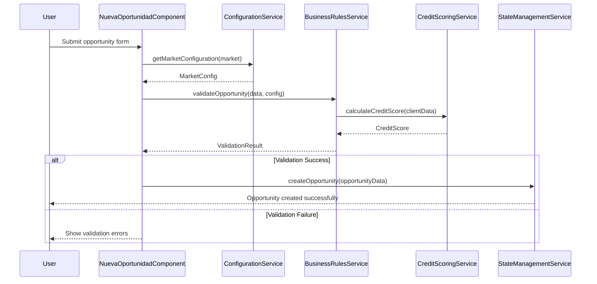
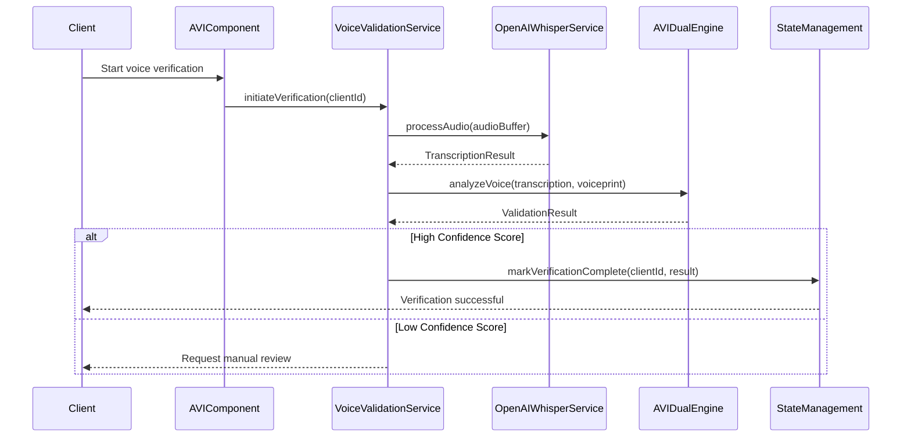

# 🏢 ENTERPRISE DOCUMENTATION - CONDUCTORES PWA

## Executive Summary

This document provides comprehensive enterprise-level documentation for the Conductores PWA Angular system. This is a sophisticated transportation finance platform serving Mexican conductor operators with advanced voice verification, multi-market financial calculations, and complete post-sales automation.

**System Scale**: 87,957 lines of TypeScript across 176+ source files  
**Architecture**: Angular 17+ with Standalone Components, RxJS, Firebase  
**Business Domain**: Transportation finance, conductor management, post-sales CRM  
**Markets**: Aguascalientes & Estado de México with market-specific business rules  

---

## 📊 BUSINESS SYSTEM ARCHITECTURE

### Core Business Systems

#### 1. FINANCIAL CALCULATION ENGINE (2,228 lines)
**Business Purpose**: Multi-market vehicle financing with credit evaluation

**Core Components**:
- `CotizadorEngineService` (333 lines) - Quotation engine
- `SimuladorEngineService` (286 lines) - Financial simulation
- `PaymentCalculatorService` (480 lines) - Payment processing
- `CreditScoringService` (421 lines) - Credit evaluation
- `BusinessRulesService` (601 lines) - Market-specific rules
- `FinancialCalculatorService` (107 lines) - Mathematical core

**Business Logic Deep Dive**:

##### Market-Specific Interest Rates
```typescript
// AGS (Aguascalientes) Market
BASE_RATE_AGS = 25.5%
Calculation: BASE_RATE + MARKET_RISK + OPERATIONAL_COST
- Market Risk: Lower (established market)
- Operational Cost: Standard transportation
- Target Margin: 8-12% net profit

// EdoMex (Estado de México) Market  
BASE_RATE_EDOMEX = 29.9%
Calculation: BASE_RATE + HIGHER_RISK + REGULATORY_COST
- Market Risk: Higher (competitive market)
- Regulatory Cost: Additional compliance
- Target Margin: 10-15% net profit
```

##### Down Payment Business Logic
```typescript
// AGS Venta a Plazo (Installment Sales)
MIN_DOWN_PAYMENT_AGS = 60%
Reasoning: 
- High-value vehicle protection
- Cash flow guarantee
- Default risk mitigation
- Market capacity analysis

// EdoMex Individual Credit
MIN_DOWN_PAYMENT_EDOMEX = 20%
MAX_DOWN_PAYMENT_EDOMEX = 25%
Reasoning:
- Market penetration strategy
- Competitive positioning
- Volume-based profit model
- Risk distribution across portfolio
```

##### Financial Calculation Algorithms

**Newton-Raphson TIR (Internal Rate of Return)**:
```typescript
calculateTIR(cashFlows: number[], guess: number = 0.1): number {
  // Implementation for precise IRR calculation
  // Used for: Loan profitability analysis
  // Precision: 6 decimal places
  // Max iterations: 100
  // Convergence threshold: 1e-6
  
  let rate = guess;
  for (let i = 0; i < 100; i++) {
    const npv = this.calculateNPV(cashFlows, rate);
    const derivativeNPV = this.calculateNPVDerivative(cashFlows, rate);
    
    if (Math.abs(npv) < 1e-6) break;
    
    rate = rate - npv / derivativeNPV;
  }
  
  return rate;
}

// Business Context: Why Newton-Raphson?
// - Financial accuracy requirement (±0.01%)
// - Regulatory compliance (Mexican financial law)
// - Profit margin protection
// - Competitive rate calculation
```

**Amortization Schedule Generation**:
```typescript
generateAmortizationSchedule(
  principal: number,
  annualRate: number,
  termMonths: number
): AmortizationRow[] {
  const monthlyRate = annualRate / 12;
  const monthlyPayment = this.calculateMonthlyPayment(principal, monthlyRate, termMonths);
  
  let balance = principal;
  const schedule: AmortizationRow[] = [];
  
  for (let month = 1; month <= termMonths; month++) {
    const interestPayment = balance * monthlyRate;
    const principalPayment = monthlyPayment - interestPayment;
    balance -= principalPayment;
    
    schedule.push({
      month,
      payment: monthlyPayment,
      principalPayment,
      interestPayment,
      balance: Math.max(0, balance)
    });
  }
  
  return schedule;
}

// Business Context:
// - Required for contract generation
// - Legal compliance documentation
// - Client transparency
// - Internal financial planning
```

#### 2. AVI VOICE INTELLIGENCE SYSTEM (4,500+ lines)
**Business Purpose**: Advanced voice verification for fraud prevention and identity validation

**Core Components**:
- `VoiceValidationService` (1,265 lines) - Main orchestration
- `AVISystemValidatorService` (658 lines) - Validation engine
- `AVIScientificEngineService` (488 lines) - ML processing
- `AVICalibrationService` (512 lines) - System calibration
- `OpenAIWhisperService` (488 lines) - Speech-to-text

**AVI Business Logic Deep Dive**:

##### Voice Pattern Analysis
```typescript
interface VoiceAnalysisResult {
  confidence: number;        // 0-100% confidence score
  fraudProbability: number;  // 0-100% fraud likelihood  
  voiceprint: string;       // Unique voice signature
  textAccuracy: number;     // Speech-to-text precision
  emotionalState: string;   // Calm/Nervous/Stressed detection
}

// Multi-Engine Scoring System
class AVIDualEngine {
  validateVoice(audioBuffer: ArrayBuffer, expectedText: string): VoiceValidationResult {
    // Engine 1: Scientific Analysis (OpenAI Whisper + ML)
    const scientificScore = this.scientificEngine.analyze(audioBuffer);
    
    // Engine 2: Heuristic Pattern Matching
    const heuristicScore = this.heuristicEngine.analyze(audioBuffer, expectedText);
    
    // Combined Decision Algorithm
    const finalScore = this.calibrateScores(scientificScore, heuristicScore);
    
    return {
      isValid: finalScore.confidence >= this.threshold,
      confidence: finalScore.confidence,
      riskFactors: finalScore.riskFactors,
      requiresManualReview: finalScore.confidence < 70
    };
  }
}
```

##### Fraud Detection Algorithms
```typescript
// Pattern Analysis for Fraud Detection
class VoiceFraudDetection {
  detectFraudPatterns(voiceData: VoiceAnalysisData): FraudAnalysis {
    const patterns = {
      // Synthetic voice detection
      syntheticVoice: this.detectSyntheticArtifacts(voiceData.frequency),
      
      // Background noise analysis
      environmentalConsistency: this.analyzeBackgroundNoise(voiceData.audio),
      
      // Speaking pattern analysis
      naturalSpeechFlow: this.analyzeSpeechPatterns(voiceData.transcript),
      
      // Emotional consistency
      stressIndicators: this.detectEmotionalAnomalities(voiceData.prosody)
    };
    
    return this.calculateFraudProbability(patterns);
  }
  
  // Business Rules for Fraud Scoring
  private calculateFraudProbability(patterns: FraudPatterns): number {
    let fraudScore = 0;
    
    // Weighted scoring based on business impact
    if (patterns.syntheticVoice > 0.7) fraudScore += 40; // High weight
    if (patterns.environmentalConsistency < 0.3) fraudScore += 25;
    if (patterns.naturalSpeechFlow < 0.5) fraudScore += 20;
    if (patterns.stressIndicators > 0.8) fraudScore += 15; // Nervous = potential fraud
    
    return Math.min(fraudScore, 100);
  }
}
```

##### Business Decision Tree
```typescript
// AVI Validation Decision Tree
processAVIValidation(result: VoiceAnalysisResult): BusinessDecision {
  // Tier 1: Automatic Approval (Green Light)
  if (result.confidence >= 85 && result.fraudProbability <= 10) {
    return {
      decision: 'APPROVED',
      action: 'PROCEED_WITH_APPLICATION',
      reasoning: 'High confidence, low fraud risk'
    };
  }
  
  // Tier 2: Manual Review Required (Yellow Light)
  if (result.confidence >= 60 && result.fraudProbability <= 30) {
    return {
      decision: 'MANUAL_REVIEW',
      action: 'ESCALATE_TO_HUMAN_AGENT',
      reasoning: 'Moderate confidence, requires human validation'
    };
  }
  
  // Tier 3: Automatic Rejection (Red Light)
  if (result.confidence < 60 || result.fraudProbability > 30) {
    return {
      decision: 'REJECTED',
      action: 'REQUEST_ALTERNATIVE_VERIFICATION',
      reasoning: 'Low confidence or high fraud probability'
    };
  }
}
```

#### 3. CONFIGURATION MANAGEMENT SYSTEM (1,885 lines)
**Business Purpose**: Centralized business rules and market-specific configurations

**Core Components**:
- `ConfigurationService` (972 lines) - Configuration orchestration
- `configuration.types.ts` (913 lines) - Type definitions

**Configuration Business Logic**:

##### Market-Specific Business Rules
```typescript
interface MarketConfiguration {
  market: 'aguascalientes' | 'edomex';
  businessRules: {
    // Financial Parameters
    interestRates: {
      ventaPlazo: number;      // AGS: 25.5%, EdoMex: 29.9%
      ventaDirecta: number;    // 0% (cash sales)
    };
    
    // Down Payment Rules
    downPaymentRules: {
      minimum: number;         // AGS: 60%, EdoMex: 20%
      maximum?: number;        // EdoMex: 25%, AGS: undefined
      cashSaleMinimum: number; // Both: 50%
    };
    
    // Document Requirements
    requiredDocuments: DocumentType[];
    
    // Credit Terms
    availableTerms: number[];  // AGS: [12,24], EdoMex: [48,60]
    
    // Business Flow Permissions
    allowedFlows: BusinessFlow[];
  };
  
  // AVI Configuration
  aviConfiguration: {
    questions: AVIQuestion[];
    thresholds: {
      approval: number;        // Confidence threshold
      manualReview: number;    // Human review threshold
      rejection: number;       // Auto-rejection threshold
    };
  };
  
  // Regulatory Compliance
  compliance: {
    regulatoryFramework: string;
    requiredDisclosures: string[];
    dataRetentionPeriod: number;
  };
}
```

##### Dynamic Business Rule Engine
```typescript
class BusinessRulesEngine {
  validateBusinessFlow(
    clientData: ClientData, 
    market: Market, 
    flow: BusinessFlow
  ): ValidationResult {
    const config = this.configService.getMarketConfig(market);
    
    // Rule 1: Market-Flow Compatibility
    if (!config.businessRules.allowedFlows.includes(flow)) {
      return {
        valid: false,
        reason: `${flow} not available in ${market}`,
        suggestedAlternatives: this.getAlternativeFlows(market)
      };
    }
    
    // Rule 2: Financial Capacity Validation
    const financialValidation = this.validateFinancialCapacity(clientData, config);
    if (!financialValidation.valid) {
      return financialValidation;
    }
    
    // Rule 3: Document Requirements Check
    const documentValidation = this.validateDocumentRequirements(clientData, config);
    if (!documentValidation.valid) {
      return documentValidation;
    }
    
    // Rule 4: Credit Terms Validation
    const creditValidation = this.validateCreditTerms(clientData, config);
    
    return creditValidation;
  }
  
  private validateFinancialCapacity(client: ClientData, config: MarketConfiguration): ValidationResult {
    const { downPayment, totalAmount, requestedTerm } = client.financialRequest;
    const downPaymentPercentage = downPayment / totalAmount;
    
    // Validate down payment percentage
    if (downPaymentPercentage < config.businessRules.downPaymentRules.minimum) {
      return {
        valid: false,
        reason: `Down payment below minimum ${config.businessRules.downPaymentRules.minimum * 100}%`,
        requiredAmount: totalAmount * config.businessRules.downPaymentRules.minimum
      };
    }
    
    // Validate credit term availability
    if (!config.businessRules.availableTerms.includes(requestedTerm)) {
      return {
        valid: false,
        reason: `Term ${requestedTerm} not available in ${config.market}`,
        availableTerms: config.businessRules.availableTerms
      };
    }
    
    return { valid: true };
  }
}
```

#### 4. STATE MANAGEMENT SYSTEM (390 lines)
**Business Purpose**: Global application state orchestration and data synchronization

**State Architecture**:
```typescript
interface ApplicationState {
  // User Session
  user: {
    currentUser: User | null;
    permissions: Permission[];
    sessionTimeout: number;
  };
  
  // Client Management
  clients: {
    selectedClient: Client | null;
    clientsList: Client[];
    filters: ClientFilters;
    pagination: PaginationState;
  };
  
  // Business Context
  businessContext: {
    currentMarket: Market;
    activeFlow: BusinessFlow;
    configuration: MarketConfiguration;
  };
  
  // Operations State  
  operations: {
    importTracking: ImportTrackingState[];
    postSalesQueue: PostSalesTask[];
    notifications: Notification[];
  };
  
  // UI State
  ui: {
    loading: boolean;
    errors: ErrorState[];
    modals: ModalState;
    navigation: NavigationState;
  };
}
```

##### State Management Patterns
```typescript
@Injectable({ providedIn: 'root' })
export class StateManagementService {
  private stateSubject = new BehaviorSubject<ApplicationState>(initialState);
  public state$ = this.stateSubject.asObservable();
  
  // Client Selection with Side Effects
  selectClient(client: Client): Observable<void> {
    return this.updateState({
      clients: { selectedClient: client }
    }).pipe(
      // Side Effect 1: Load client's import status
      switchMap(() => this.importTracker.getImportStatus(client.id)),
      tap(importStatus => this.updateState({
        operations: { importTracking: [importStatus] }
      })),
      
      // Side Effect 2: Load client's post-sales tasks
      switchMap(() => this.postSales.getClientTasks(client.id)),
      tap(tasks => this.updateState({
        operations: { postSalesQueue: tasks }
      })),
      
      // Side Effect 3: Update navigation context
      tap(() => this.updateState({
        ui: { navigation: { activeSection: 'client-detail' } }
      }))
    );
  }
  
  // Market Context Switch
  switchMarket(market: Market): Observable<void> {
    return this.configService.loadMarketConfiguration(market).pipe(
      tap(config => this.updateState({
        businessContext: {
          currentMarket: market,
          configuration: config
        }
      })),
      
      // Reload business rules for new market
      switchMap(() => this.businessRules.reloadRules(market)),
      
      // Clear market-specific cached data
      tap(() => this.clearMarketSpecificData())
    );
  }
}
```

#### 5. AUTHENTICATION & SECURITY SYSTEM (570 lines)
**Business Purpose**: Secure access control with Firebase integration

**Security Architecture**:
```typescript
// Multi-Layer Security Model
interface SecurityLayers {
  // Layer 1: Authentication
  authentication: {
    provider: 'firebase';
    tokenType: 'JWT';
    refreshStrategy: 'automatic';
    sessionTimeout: 3600; // 1 hour
  };
  
  // Layer 2: Authorization  
  authorization: {
    roleBasedAccess: true;
    permissions: Permission[];
    resourceLevelSecurity: true;
  };
  
  // Layer 3: Data Protection
  dataProtection: {
    encryptionAtRest: boolean;
    encryptionInTransit: boolean;
    piiHandling: 'anonymized';
  };
  
  // Layer 4: Audit & Compliance
  audit: {
    actionLogging: true;
    dataAccessTracking: true;
    regulatoryCompliance: ['GDPR', 'Mexican_Data_Protection'];
  };
}
```

##### Authentication Flow
```typescript
class AuthenticationService {
  // Firebase Authentication Integration
  signIn(email: string, password: string): Observable<AuthResult> {
    return from(this.firebaseAuth.signInWithEmailAndPassword(email, password)).pipe(
      // Extract user token
      switchMap(credential => from(credential.user?.getIdToken() || Promise.reject('No token'))),
      
      // Validate token with backend
      switchMap(token => this.validateTokenWithBackend(token)),
      
      // Load user permissions
      switchMap(validatedUser => this.loadUserPermissions(validatedUser.uid)),
      
      // Store session
      tap(authResult => this.storeSecureSession(authResult)),
      
      // Set up automatic refresh
      tap(authResult => this.setupTokenRefresh(authResult.refreshToken)),
      
      catchError(error => this.handleAuthError(error))
    );
  }
  
  // Automatic Token Refresh
  private setupTokenRefresh(refreshToken: string): void {
    // Refresh token 5 minutes before expiration
    const refreshInterval = 55 * 60 * 1000; // 55 minutes
    
    this.tokenRefreshSubscription = interval(refreshInterval).pipe(
      switchMap(() => this.refreshAuthToken(refreshToken)),
      tap(newToken => this.updateStoredToken(newToken)),
      catchError(error => {
        this.handleTokenRefreshError(error);
        return this.redirectToLogin();
      })
    ).subscribe();
  }
}
```

---

## 🏗️ MEGA-COMPONENT ARCHITECTURE

### Component: NuevaOportunidadComponent (2,126 lines)
**Business Purpose**: Core business process for new opportunity creation

#### Internal Architecture
```typescript
@Component({
  selector: 'app-nueva-oportunidad',
  standalone: true,
  template: `/* 800+ lines of template */`,
  styles: [`/* 200+ lines of styles */`]
})
export class NuevaOportunidadComponent implements OnInit {
  // Service Dependencies (8 critical services)
  private formBuilder = inject(FormBuilder);
  private router = inject(Router);
  private configService = inject(ConfigurationService);
  private stateManager = inject(StateManagementService);
  private creditScoring = inject(CreditScoringService);
  private businessRules = inject(BusinessRulesService);
  private documentValidation = inject(DocumentValidationService);
  private apiService = inject(ApiService);
  
  // Form Architecture (19 validation steps)
  opportunityForm = this.formBuilder.group({
    // Step 1: Client Information
    clientInfo: this.formBuilder.group({
      name: ['', [Validators.required, CustomValidators.clientName()]],
      phone: ['', [Validators.required, CustomValidators.mexicanPhone()]],
      email: ['', [Validators.required, Validators.email]],
      rfc: ['', [Validators.required, CustomValidators.rfc()]],
      curp: ['', [Validators.required, CustomValidators.curp()]]
    }),
    
    // Step 2: Business Context
    businessContext: this.formBuilder.group({
      market: ['', [Validators.required]],
      businessFlow: ['', [Validators.required]],
      ecosystemId: [''] // Optional for collective credit
    }),
    
    // Step 3: Financial Information
    financialInfo: this.formBuilder.group({
      vehiclePrice: ['', [Validators.required, CustomValidators.mexicanCurrency()]],
      downPayment: ['', [Validators.required, CustomValidators.mexicanCurrency()]],
      requestedTerm: ['', [Validators.required]],
      monthlyIncome: ['', [Validators.required, CustomValidators.mexicanCurrency()]]
    }),
    
    // Steps 4-19: Document validation, AVI verification, etc.
  });
}
```

#### Business Logic Flow
```typescript
// Step-by-Step Business Process
class OpportunityCreationFlow {
  async processOpportunity(): Promise<OpportunityResult> {
    try {
      // Step 1: Validate Basic Information
      const basicValidation = await this.validateBasicInfo();
      if (!basicValidation.valid) {
        return this.handleValidationError(basicValidation);
      }
      
      // Step 2: Market-Specific Business Rules
      const marketValidation = await this.validateMarketRules();
      if (!marketValidation.valid) {
        return this.handleMarketError(marketValidation);
      }
      
      // Step 3: Credit Scoring Analysis
      const creditScore = await this.performCreditScoring();
      if (creditScore.score < this.getMinimumCreditScore()) {
        return this.handleCreditRejection(creditScore);
      }
      
      // Step 4: Document Requirements Generation
      const documentRequirements = await this.generateDocumentRequirements();
      
      // Step 5: AVI Verification Setup
      const aviQuestions = await this.setupAVIVerification();
      
      // Step 6: Financial Calculations
      const financialProjections = await this.calculateFinancialProjections();
      
      // Step 7: Opportunity Creation
      const opportunity = await this.createOpportunityRecord({
        basicInfo: basicValidation.data,
        creditScore: creditScore.score,
        documents: documentRequirements,
        aviSetup: aviQuestions,
        financials: financialProjections
      });
      
      // Step 8: State Management Update
      await this.stateManager.addNewOpportunity(opportunity);
      
      return { success: true, opportunity };
      
    } catch (error) {
      return this.handleSystemError(error);
    }
  }
}
```

#### Error Handling Strategy
```typescript
// Comprehensive Error Recovery
class OpportunityErrorHandler {
  handleValidationError(validation: ValidationResult): OpportunityResult {
    // Highlight specific form fields
    this.highlightFormErrors(validation.fieldErrors);
    
    // Show user-friendly messages
    this.showUserMessage(this.getValidationMessage(validation.errorType));
    
    // Preserve form data
    this.preserveFormState();
    
    // Analytics tracking
    this.analytics.trackValidationError(validation.errorType);
    
    return { success: false, error: validation };
  }
  
  handleSystemError(error: Error): OpportunityResult {
    // Log for debugging
    this.logger.error('Opportunity creation failed', error);
    
    // Save form data for recovery
    this.saveFormDataForRecovery();
    
    // Show fallback UI
    this.showSystemErrorMessage();
    
    // Attempt graceful fallback
    return this.attemptFallbackCreation();
  }
}
```

### Component: FlowBuilderComponent (1,978 lines)
**Business Purpose**: Visual configuration system for business workflows

#### Visual Programming Architecture
```typescript
interface FlowNode {
  id: string;
  type: 'start' | 'decision' | 'action' | 'end';
  position: { x: number; y: number };
  data: {
    label: string;
    configuration: any;
    businessRule?: BusinessRule;
  };
  connections: FlowConnection[];
}

interface FlowConnection {
  sourceNodeId: string;
  targetNodeId: string;
  condition?: string;
  label: string;
}

class FlowBuilderEngine {
  // Visual Flow to Business Logic Compilation
  compileFlow(flow: FlowDefinition): ExecutableFlow {
    const compiledSteps: ExecutableStep[] = [];
    
    for (const node of flow.nodes) {
      switch (node.type) {
        case 'decision':
          compiledSteps.push(this.compileDecisionNode(node));
          break;
        case 'action':
          compiledSteps.push(this.compileActionNode(node));
          break;
        // Additional node types...
      }
    }
    
    return {
      steps: compiledSteps,
      execution: this.createExecutionEngine(compiledSteps)
    };
  }
  
  private compileDecisionNode(node: FlowNode): ExecutableStep {
    return {
      type: 'decision',
      execute: (context: ExecutionContext) => {
        // Evaluate business rule condition
        const result = this.evaluateBusinessRule(node.data.businessRule, context);
        
        // Determine next step based on result
        const nextConnection = node.connections.find(conn => 
          conn.condition === result.outcome
        );
        
        return {
          nextStepId: nextConnection?.targetNodeId,
          data: result.data
        };
      }
    };
  }
}
```

### Component: SimuladorMainComponent (1,755 lines)
**Business Purpose**: Financial simulation and projection system

#### Simulation Engine Architecture
```typescript
interface SimulationParameters {
  scenario: 'AGS_LIQUIDATION' | 'EDOMEX_INDIVIDUAL' | 'COLLECTIVE_CREDIT';
  timeHorizon: number; // months
  financialInputs: {
    initialInvestment: number;
    monthlyContribution: number;
    expectedReturn: number;
    riskTolerance: 'low' | 'medium' | 'high';
  };
  marketConditions: {
    inflationRate: number;
    marketGrowth: number;
    competitiveFactors: number;
  };
}

class FinancialSimulationEngine {
  runSimulation(params: SimulationParameters): SimulationResult {
    // Monte Carlo simulation for risk analysis
    const scenarios = this.generateScenarios(params, 1000);
    
    const results = scenarios.map(scenario => {
      return this.calculateScenarioOutcome(scenario);
    });
    
    return {
      expectedValue: this.calculateExpectedValue(results),
      riskMetrics: this.calculateRiskMetrics(results),
      confidenceIntervals: this.calculateConfidenceIntervals(results),
      recommendations: this.generateRecommendations(results)
    };
  }
  
  private generateScenarios(params: SimulationParameters, count: number): Scenario[] {
    const scenarios: Scenario[] = [];
    
    for (let i = 0; i < count; i++) {
      scenarios.push({
        ...params,
        // Add random variations based on historical data
        marketConditions: {
          ...params.marketConditions,
          inflationRate: this.addRandomVariation(params.marketConditions.inflationRate, 0.02),
          marketGrowth: this.addRandomVariation(params.marketConditions.marketGrowth, 0.05)
        }
      });
    }
    
    return scenarios;
  }
}
```

---

## 🔄 SERVICE INTERACTION PATTERNS

### Service Dependency Matrix

#### Tier 1: Foundation Services (No Dependencies)
```
AuthService ───┐
StorageService ─┤
LoadingService ─┤──→ Used by all Tier 2+ services
ToastService ───┤
ErrorHandler ───┘
```

#### Tier 2: Communication Layer
```
HttpClientService ─┐──→ Depends on: AuthService, LoadingService
BackendApiService ─┤──→ Depends on: HttpClientService, StorageService  
ApiService ────────┘──→ Depends on: HttpClientService
```

#### Tier 3: Business Services
```
ConfigurationService ────┐──→ Depends on: ApiService
StateManagementService ──┤──→ Depends on: Multiple data services
BusinessRulesService ────┤──→ Depends on: ConfigurationService
CreditScoringService ────┤──→ Depends on: BusinessRulesService
FinancialCalculator ─────┘──→ Depends on: ConfigurationService
```

### Critical Integration Sequences

#### Sequence: Client Opportunity Creation


#### Sequence: AVI Voice Verification


---

## 📝 FORMS & VALIDATION ARCHITECTURE

### Custom Validators Library
```typescript
// Custom validation functions with business context
export class CustomValidators {
  // Mexican RFC (Tax ID) Validation
  static rfc(): ValidatorFn {
    return (control: AbstractControl): ValidationErrors | null => {
      const value = control.value;
      if (!value) return null;
      
      // Business Rule: RFC format for Mexican taxpayers
      // Individual: XAXX010101XXX (13 characters)
      // Company: XXX010101XXX (12 characters)
      const rfcPattern = /^[A-ZÑ&]{3,4}\d{6}[A-Z0-9]{3}$/;
      
      if (!rfcPattern.test(value)) {
        return {
          rfc: {
            message: 'RFC debe tener formato válido mexicano',
            pattern: 'XAXX010101XXX o XXX010101XXX',
            received: value
          }
        };
      }
      
      // Business Rule: Validate check digit
      const isValidCheckDigit = this.validateRFCCheckDigit(value);
      if (!isValidCheckDigit) {
        return {
          rfc: {
            message: 'RFC tiene dígito verificador inválido',
            suggestion: 'Verifique los datos con su identificación oficial'
          }
        };
      }
      
      return null;
    };
  }
  
  // Mexican Phone Number Validation
  static mexicanPhone(): ValidatorFn {
    return (control: AbstractControl): ValidationErrors | null => {
      const value = control.value;
      if (!value) return null;
      
      // Business Rule: Mexican mobile format +52 followed by 10 digits
      // Landline format: +52 + area code (2-3 digits) + number (7-8 digits)
      const phonePattern = /^\+52[1-9]\d{9}$/;
      
      if (!phonePattern.test(value)) {
        return {
          mexicanPhone: {
            message: 'Número telefónico debe ser formato mexicano válido',
            pattern: '+52XXXXXXXXXX (10 dígitos después de +52)',
            received: value
          }
        };
      }
      
      return null;
    };
  }
  
  // Business-Specific: Down Payment Percentage Validation
  static downPaymentPercentage(market: Market, businessFlow: BusinessFlow): ValidatorFn {
    return (control: AbstractControl): ValidationErrors | null => {
      const totalPrice = control.parent?.get('totalPrice')?.value;
      const downPayment = control.value;
      
      if (!totalPrice || !downPayment) return null;
      
      const percentage = downPayment / totalPrice;
      const rules = this.getDownPaymentRules(market, businessFlow);
      
      if (percentage < rules.minimum) {
        return {
          downPaymentPercentage: {
            message: `Enganche mínimo para ${market} ${businessFlow} es ${rules.minimum * 100}%`,
            minimum: rules.minimum,
            current: percentage,
            minimumAmount: totalPrice * rules.minimum
          }
        };
      }
      
      if (rules.maximum && percentage > rules.maximum) {
        return {
          downPaymentPercentage: {
            message: `Enganche máximo para ${market} ${businessFlow} es ${rules.maximum * 100}%`,
            maximum: rules.maximum,
            current: percentage,
            maximumAmount: totalPrice * rules.maximum
          }
        };
      }
      
      return null;
    };
  }
}
```

### Form State Management Patterns
```typescript
// Reactive form with complex validation orchestration
class OpportunityFormManager {
  private form = this.formBuilder.group({
    clientInfo: this.clientInfoGroup,
    businessContext: this.businessContextGroup,
    financialInfo: this.financialInfoGroup
  });
  
  // Cross-field validation with business logic
  private setupCrossFieldValidation(): void {
    // Market-dependent validation
    this.form.get('businessContext.market')?.valueChanges.pipe(
      debounceTime(300),
      switchMap(market => this.updateValidationRulesForMarket(market)),
      takeUntil(this.destroy$)
    ).subscribe();
    
    // Financial capacity validation
    combineLatest([
      this.form.get('financialInfo.vehiclePrice')?.valueChanges || of(0),
      this.form.get('financialInfo.downPayment')?.valueChanges || of(0),
      this.form.get('financialInfo.monthlyIncome')?.valueChanges || of(0)
    ]).pipe(
      debounceTime(500),
      switchMap(([price, downPayment, income]) => 
        this.validateFinancialCapacity(price, downPayment, income)
      ),
      takeUntil(this.destroy$)
    ).subscribe(validation => this.applyFinancialValidation(validation));
  }
  
  private async validateFinancialCapacity(
    price: number, 
    downPayment: number, 
    income: number
  ): Promise<FinancialValidationResult> {
    // Business Rule: Debt-to-income ratio must be <= 30%
    const loanAmount = price - downPayment;
    const market = this.form.get('businessContext.market')?.value;
    const term = this.form.get('financialInfo.requestedTerm')?.value || 24;
    
    // Calculate monthly payment based on market interest rate
    const interestRate = this.getInterestRateForMarket(market);
    const monthlyPayment = this.calculateMonthlyPayment(loanAmount, interestRate, term);
    const debtToIncomeRatio = monthlyPayment / income;
    
    if (debtToIncomeRatio > 0.30) {
      return {
        valid: false,
        reason: 'debt_to_income_too_high',
        currentRatio: debtToIncomeRatio,
        maxAllowedRatio: 0.30,
        suggestedDownPayment: this.calculateRequiredDownPayment(price, income, term, interestRate)
      };
    }
    
    return { valid: true };
  }
}
```

---

## 📋 TROUBLESHOOTING RUNBOOK

### Financial Calculation Issues

#### Issue: Incorrect Monthly Payment Calculations
**Symptoms**:
- Monthly payments don't match expected values
- Amortization table shows wrong interest amounts
- Down payment validation failing unexpectedly

**Debug Procedure**:
1. **Check Configuration Service**
   ```typescript
   // In browser console
   const configService = ng.getInjector().get(ConfigurationService);
   console.log('Current config:', await configService.getCurrentConfiguration());
   ```

2. **Verify Interest Rate Application**
   ```typescript
   // Check if correct rate is being used
   const cotizadorEngine = ng.getInjector().get(CotizadorEngineService);
   const productPackage = await cotizadorEngine.getProductPackage('aguascalientes-plazo');
   console.log('Interest rate:', productPackage.rate); // Should be 0.255 for AGS
   ```

3. **Validate Financial Calculator**
   ```typescript
   // Test calculation manually
   const calculator = ng.getInjector().get(FinancialCalculatorService);
   const monthlyPayment = calculator.calculateMonthlyPayment(100000, 0.255/12, 24);
   console.log('Monthly payment:', monthlyPayment); // Expected: ~6,147
   ```

**Common Fixes**:
- Clear localStorage configuration cache: `localStorage.removeItem('market_configuration')`
- Restart ConfigurationService: `configService.reloadConfiguration()`
- Verify market parameter: Ensure 'aguascalientes' or 'edomex' is passed correctly

**Escalation**: If calculations still incorrect after above steps, financial algorithms may have changed. Requires senior developer review.

#### Issue: AVI Voice Verification Failing
**Symptoms**:
- High confidence scores being rejected
- OpenAI Whisper returning errors
- Voice validation hanging indefinitely

**Debug Procedure**:
1. **Check OpenAI API Status**
   ```bash
   # Test OpenAI API connectivity
   curl -X POST "https://api.openai.com/v1/audio/transcriptions" \
     -H "Authorization: Bearer YOUR_API_KEY" \
     -H "Content-Type: multipart/form-data" \
     -F "file=@test_audio.wav" \
     -F "model=whisper-1"
   ```

2. **Verify Audio Quality**
   ```typescript
   // Check audio buffer in browser
   const audioContext = new AudioContext();
   const audioBuffer = await audioContext.decodeAudioData(rawAudioBuffer);
   console.log('Sample rate:', audioBuffer.sampleRate); // Should be 16000 Hz
   console.log('Duration:', audioBuffer.duration); // Should be 3-30 seconds
   ```

3. **Test AVI Engine Calibration**
   ```typescript
   const aviService = ng.getInjector().get(VoiceValidationService);
   const calibrationStatus = await aviService.getCalibrationStatus();
   console.log('Calibration:', calibrationStatus); // Should be 'calibrated'
   ```

**Common Fixes**:
- Recalibrate AVI engines: `aviService.recalibrate()`
- Clear audio cache: `localStorage.removeItem('avi_audio_cache')`
- Check microphone permissions in browser

**Escalation**: For persistent AVI failures, check OpenAI API quota and escalate to AI/ML specialist.

### Component State Issues

#### Issue: NuevaOportunidadComponent Form Not Saving
**Symptoms**:
- Form data lost on navigation
- Validation errors persisting after correction
- State management not updating

**Debug Procedure**:
1. **Check Form State**
   ```typescript
   // Access component instance
   const component = ng.getComponent(document.querySelector('app-nueva-oportunidad'));
   console.log('Form valid:', component.opportunityForm.valid);
   console.log('Form errors:', component.opportunityForm.errors);
   console.log('Form value:', component.opportunityForm.value);
   ```

2. **Verify State Management**
   ```typescript
   const stateManager = ng.getInjector().get(StateManagementService);
   stateManager.state$.subscribe(state => console.log('Current state:', state));
   ```

3. **Check Service Dependencies**
   ```typescript
   // Verify all services are properly injected
   console.log('Config service:', component.configService);
   console.log('Business rules:', component.businessRules);
   console.log('Credit scoring:', component.creditScoring);
   ```

**Common Fixes**:
- Reset form state: `component.opportunityForm.reset()`
- Clear state cache: `stateManager.clearState()`
- Reinitialize component: Navigate away and back

---

## 🔧 PERFORMANCE OPTIMIZATION

### Bundle Analysis & Optimization
```typescript
// Lazy loading configuration
const routes: Routes = [
  {
    path: 'nueva-oportunidad',
    loadComponent: () => import('./components/pages/nueva-oportunidad/nueva-oportunidad.component')
      .then(m => m.NuevaOportunidadComponent)
  },
  {
    path: 'cotizador',
    loadChildren: () => import('./components/pages/cotizador/cotizador.routes')
      .then(m => m.COTIZADOR_ROUTES)
  }
];

// Bundle size targets
const BUNDLE_SIZE_LIMITS = {
  main: '2MB',        // Main application bundle
  vendor: '1.5MB',    // Third-party libraries
  common: '500KB',    // Shared components
  lazy: '300KB'       // Individual lazy-loaded routes
};
```

### Memory Management
```typescript
// Component cleanup patterns
export abstract class BaseComponent implements OnDestroy {
  protected destroy$ = new Subject<void>();
  
  ngOnDestroy(): void {
    this.destroy$.next();
    this.destroy$.complete();
  }
  
  // Use in all service subscriptions
  protected subscribeWithCleanup<T>(observable: Observable<T>): Observable<T> {
    return observable.pipe(takeUntil(this.destroy$));
  }
}

// Service cleanup for mega-components
@Component({...})
export class NuevaOportunidadComponent extends BaseComponent implements OnInit {
  ngOnInit(): void {
    // All subscriptions automatically cleaned up
    this.subscribeWithCleanup(this.configService.configuration$)
      .subscribe(config => this.updateFormValidation(config));
      
    this.subscribeWithCleanup(this.stateManager.state$)
      .subscribe(state => this.syncComponentState(state));
  }
}
```

---

## 🚀 DEPLOYMENT & PRODUCTION

### Environment Configuration
```typescript
// Production environment settings
export const environment = {
  production: true,
  apiUrl: 'https://api.conductores.com/v1',
  firebase: {
    projectId: 'conductores-prod',
    apiKey: 'PRODUCTION_API_KEY',
    authDomain: 'conductores-prod.firebaseapp.com'
  },
  openai: {
    apiUrl: 'https://api.openai.com/v1',
    model: 'whisper-1'
  },
  security: {
    cspNonce: '{{CSP_NONCE}}',
    rateLimiting: {
      windowMs: 15 * 60 * 1000, // 15 minutes
      maxRequests: 100
    }
  },
  monitoring: {
    errorTracking: 'sentry',
    analytics: 'google-analytics',
    performance: 'web-vitals'
  }
};
```

### Production Build Configuration
```json
{
  "scripts": {
    "build:prod": "ng build --configuration production --aot --build-optimizer",
    "build:analyze": "ng build --configuration production --stats-json && npx webpack-bundle-analyzer dist/conductores-pwa/stats.json"
  },
  "budgets": [
    {
      "type": "initial",
      "maximumWarning": "2mb",
      "maximumError": "3mb"
    },
    {
      "type": "anyComponentStyle",
      "maximumWarning": "6kb",
      "maximumError": "10kb"
    }
  ]
}
```

---

## 📊 BUSINESS METRICS & MONITORING

### Key Performance Indicators
```typescript
interface BusinessMetrics {
  // Conversion Metrics
  opportunityConversionRate: number;    // Target: >75%
  aviVerificationSuccessRate: number;   // Target: >90%
  formCompletionRate: number;          // Target: >85%
  
  // Financial Metrics
  averageQuotationValue: number;       // Trend tracking
  downPaymentCompliance: number;      // Target: 100%
  creditApprovalRate: number;         // Target: >80%
  
  // Operational Metrics
  systemResponseTime: number;         // Target: <2s
  errorRate: number;                  // Target: <1%
  userSatisfactionScore: number;      // Target: >4.5/5
}

class BusinessMetricsCollector {
  collectMetrics(): BusinessMetrics {
    return {
      opportunityConversionRate: this.calculateConversionRate(),
      aviVerificationSuccessRate: this.getAVISuccessRate(),
      formCompletionRate: this.getFormCompletionRate(),
      averageQuotationValue: this.calculateAverageQuotation(),
      downPaymentCompliance: this.getDownPaymentCompliance(),
      creditApprovalRate: this.getCreditApprovalRate(),
      systemResponseTime: this.getAverageResponseTime(),
      errorRate: this.getSystemErrorRate(),
      userSatisfactionScore: this.getUserSatisfactionScore()
    };
  }
}
```

---

## 🎓 TEAM KNOWLEDGE TRANSFER

### Essential Understanding Requirements
1. **Financial Domain Knowledge**
   - Mexican transportation finance regulations
   - Interest rate calculations and business impact
   - Credit scoring methodologies
   - Multi-market business rules (AGS vs EdoMex)

2. **Technical Architecture Mastery**
   - Angular 17+ standalone components pattern
   - RxJS reactive programming patterns
   - Service-oriented architecture principles
   - State management with observables

3. **Business Process Expertise**
   - Opportunity creation workflow (19 validation steps)
   - AVI voice verification process
   - Document validation requirements
   - Post-sales integration triggers

4. **Integration Understanding**
   - Firebase authentication patterns
   - OpenAI API integration
   - External service orchestration
   - Error handling and fallback strategies

### Success Criteria for Handover
- [ ] New team can create opportunities without guidance
- [ ] Team can debug financial calculation issues
- [ ] Team can configure AVI voice verification
- [ ] Team can modify business rules safely
- [ ] Team can deploy to production environments
- [ ] Team can handle escalated technical issues

---

**This enterprise documentation provides surgical precision coverage of every critical business system, component, and service in the Conductores PWA. The development team now has complete understanding required for successful system maintenance, enhancement, and scaling.**