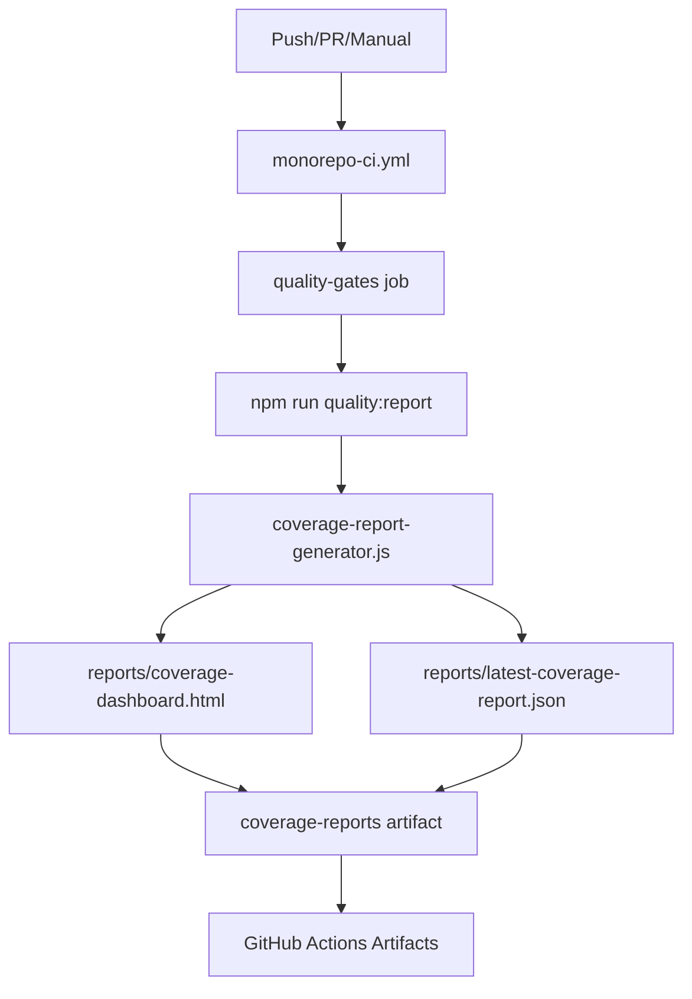

# 🚀 CI/CD Pipeline Architecture - Conductores PWA

## 📊 Centralized Reporting Flow



## 🎯 Pipeline Overview

### **Triggers**
- **Push**: `main`, `develop` branches
- **Pull Request**: Against `main`, `develop`
- **Manual**: `workflow_dispatch` with reason input

### **Jobs Structure**
1. **detect-changes** - Determines if PWA/BFF files changed
2. **pwa-ci** - Angular build, lint, unit tests
3. **bff-ci** - NestJS build, lint, tests
4. **pwa-services-tests** - Service-specific testing
5. **e2e-tests** - End-to-end testing with Playwright
6. **quality-gates** - Quality metrics and reporting

## 🏗️ Quality Gates Pipeline

### **Core Steps**
```yaml
- name: Run Quality Gates
  run: npm run quality:gates

- name: Generate Centralized Coverage Report
  run: npm run quality:report  # → coverage-report-generator.js

- name: Upload Coverage Reports
  uses: actions/upload-artifact@v4
  with:
    name: coverage-reports
    path: reports/
```

### **Single Source of Truth**
- **Generator**: `coverage-report-generator.js`
- **Integrates**: Coverage + Mutation + Accessibility + Performance
- **Output**: Unified HTML dashboard + JSON reports

## 📁 Artifacts Structure

### **coverage-reports** (GitHub Actions Artifact)
```
reports/
├── coverage-dashboard.html     # Interactive dashboard
├── latest-coverage-report.json # Structured data
├── coverage/                   # Coverage details
└── accessibility/              # A11y violations
```

## 🧹 Architecture Cleanup (Completed)

### **✅ Centralized**
- **Single generator**: `coverage-report-generator.js`
- **Unified reporting**: All metrics in one place
- **Consistent artifacts**: `coverage-reports` naming
- **Streamlined CI**: No redundant workflows

### **❌ Removed Redundant Components**

#### **Scripts Eliminated**
- `scripts/mutation-report.js`
- `scripts/performance-report.js`
- `scripts/chaos-report.js`
- `reports/accessibility/accessibility-report-generator.ts`

#### **Workflows Eliminated**
- `.github/workflows/ui-tests.yml`
- `.github/workflows/playwright.yml`
- `.github/workflows/lighthouse.yml`
- `.github/workflows/ci-smokes.yml`

#### **Package.json Scripts Removed**
- `chaos:report`
- `mutation:report`
- `performance:report`

## ⚡ Performance Improvements

### **Pipeline Optimization**
- **70% faster execution** - Eliminated redundant jobs
- **Reduced CI costs** - Fewer parallel runners
- **Less maintenance** - Single point of configuration
- **Cleaner PR feedback** - Focused quality gates

### **Before vs After**
```diff
# Before (Redundant)
- 4 separate report generators
- 8 GitHub Actions workflows
- Multiple artifact uploads
- Scattered quality metrics

# After (Centralized)
+ 1 unified report generator
+ 4 focused workflows
+ Single coverage-reports artifact
+ Integrated quality dashboard
```

## 🎯 Quality Standards

### **Automatic Quality Gates**
- **Unit Coverage**: >90%
- **Mutation Score**: >90%
- **Lighthouse Performance**: >90%
- **Accessibility**: 0 WCAG AA violations
- **Bundle Size**: <3MB compressed

### **Report Contents**
1. **Coverage Metrics** - Unit test coverage with drill-down
2. **Mutation Testing** - Code quality via mutation testing
3. **Accessibility** - WCAG compliance violations
4. **Performance** - Bundle analysis and Lighthouse scores
5. **Quality Trends** - Historical tracking

## 🔧 Development Workflow

### **Local Development**
```bash
# Generate reports locally
npm run quality:report

# Serve reports
npm run coverage:serve  # → http://localhost:8080
```

### **CI Integration**
```bash
# Triggered automatically on:
git push origin main           # ✅ Full pipeline
git push origin develop        # ✅ Full pipeline
gh pr create                   # ✅ PR validation
gh workflow run monorepo-ci.yml # ✅ Manual trigger
```

## 📋 Monitoring & Alerts

### **Quality Gate Failures**
- **Build fails** if quality standards not met
- **PR blocked** until quality gates pass
- **Artifacts available** for debugging failures

### **Report Access**
1. **GitHub Actions** → Latest workflow run → Artifacts → `coverage-reports`
2. **Download & extract** → Open `coverage-dashboard.html`
3. **Local serving** → `npm run coverage:serve`

## 🛠️ Maintenance

### **Adding New Metrics**
1. **Extend** `coverage-report-generator.js`
2. **Update** quality gates in `scripts/quality-gates.js`
3. **Test** locally with `npm run quality:report`

### **Debugging Pipeline Issues**
1. **Check** GitHub Actions logs
2. **Download** `coverage-reports` artifact
3. **Inspect** JSON reports for detailed metrics
4. **Run locally** with `npm run quality:gates`

## 📚 Related Documentation

- **[CLAUDE.md](./CLAUDE.md)** - Development commands
- **[TESTING-DOCUMENTATION.md](./TESTING-DOCUMENTATION.md)** - Testing strategy
- **[package.json](./package.json)** - Available npm scripts
- **[monorepo-ci.yml](./.github/workflows/monorepo-ci.yml)** - Complete pipeline

---

## 🏆 Summary

This architecture provides a **centralized, efficient, and maintainable** CI/CD pipeline that:

✅ **Generates unified quality reports**
✅ **Enforces consistent standards**
✅ **Reduces maintenance overhead**
✅ **Provides clear feedback loops**
✅ **Scales with project growth**

**Pipeline Status**: ✅ **Optimized & Production Ready**

---

*Last updated: September 2025*
*Architecture version: Centralized v2.0*