# 🏗️ DOCUMENTACIÓN TÉCNICA - SISTEMA HASE DE EVALUACIÓN DE VOZ

**Proyecto:** Conductores PWA - Sistema HASE  
**Versión:** 1.0.0  
**Fecha:** 2025-09-02  
**Equipo:** Desarrollo de Productos Financieros

---

## 📋 ÍNDICE

1. [Arquitectura General](#arquitectura-general)
2. [Funcionalidades Quirúrgicas](#funcionalidades-quirúrgicas)
3. [Componente AVI Verification Modal](#componente-avi-verification-modal)
4. [Servicios Core](#servicios-core)
5. [Flujo de Datos](#flujo-de-datos)
6. [Patrones de Diseño](#patrones-de-diseño)
7. [Configuración y Deployment](#configuración-y-deployment)

---

## 🏛️ ARQUITECTURA GENERAL

### Diagrama de Alto Nivel

```
┌─────────────────────────────────────────────────────────────┐
│                    CONDUCTORES PWA                          │
├─────────────────────────────────────────────────────────────┤
│  🎤 AVI Verification Modal Component (UI Layer)            │
│  ├─ Voice Recording Interface                               │
│  ├─ Real-time Semáforo Display                            │
│  ├─ Loading States & Error Handling                        │
│  └─ Resilience Summary Display                             │
├─────────────────────────────────────────────────────────────┤
│  ⚙️ Services Layer (Business Logic)                       │
│  ├─ VoiceValidationService (Core Engine)                   │
│  ├─ AviQuestionGeneratorService                           │
│  ├─ VoiceFraudDetectionService                            │
│  └─ HttpClientService (API Communication)                  │
├─────────────────────────────────────────────────────────────┤
│  📊 HASE Scoring Engine (Mathematical Core)                │
│  ├─ Voice Analysis (50% weight)                            │
│  ├─ Geographic Risk (20% weight)                           │
│  ├─ Historical GNV (30% weight)                           │
│  └─ Fallback Mechanisms                                    │
├─────────────────────────────────────────────────────────────┤
│  🌐 Backend Integration (BFF Layer)                        │
│  ├─ Voice Analysis API                                     │
│  ├─ Client Data API                                        │
│  ├─ Geographic Risk Database                               │
│  └─ Historical Data API                                    │
└─────────────────────────────────────────────────────────────┘
```

### Stack Tecnológico

- **Frontend:** Angular 17+ (Standalone Components)
- **Language:** TypeScript 5.x
- **Styling:** CSS3 + CSS Grid + Flexbox
- **State Management:** RxJS + Local Component State
- **Audio Processing:** Web Audio API + MediaRecorder
- **HTTP Client:** Angular HttpClient
- **Build System:** Angular CLI + esbuild
- **Testing:** Jest + Custom Test Suites

---

## ⚡ FUNCIONALIDADES QUIRÚRGICAS

### 1. 🎯 HASE Scoring Algorithm

**Ubicación:** `src/app/services/voice-validation.service.ts:920-985`

```typescript
/**
 * ✅ FUNCIÓN QUIRÚRGICA: Cálculo HASE Score
 * Formula: (GNV × 30%) + (GeoRisk × 20%) + (Voice × 50%)
 */
private calculateHASEScore(
  historicalGNV: number,
  geographicRisk: number, 
  voiceResilience: number
): HASEResult {
  const weights = {
    historical: 0.30,    // 30% peso histórico GNV
    geographic: 0.20,    // 20% peso riesgo geográfico  
    voice: 0.50          // 50% peso voz/resiliencia
  };
  
  // Normalización a escala 0-10
  const normalizedGNV = Math.min(10, Math.max(0, historicalGNV));
  const normalizedGeo = Math.min(10, Math.max(0, 10 - geographicRisk));
  const normalizedVoice = Math.min(10, Math.max(0, voiceResilience));
  
  // Cálculo HASE
  const haseScore = (
    normalizedGNV * weights.historical +
    normalizedGeo * weights.geographic +
    normalizedVoice * weights.voice
  );
  
  return {
    haseScore: Math.round(haseScore * 100) / 100,
    components: { gnv: normalizedGNV, geo: normalizedGeo, voice: normalizedVoice },
    recommendation: this.getHASERecommendation(haseScore)
  };
}
```

### 2. 🗣️ Voice Score Calculation

**Ubicación:** `src/app/services/voice-validation.service.ts:1100-1180`

```typescript
/**
 * ✅ FUNCIÓN QUIRÚRGICA: Voice Score Algorithm
 * Basado en 5 métricas de la industria bancaria/seguros
 */
private calculateVoiceScore(metrics: VoiceMetrics): VoiceScoreResult {
  const weights = {
    latency: 0.15,              // 15% - Tiempo de respuesta
    pitch_variability: 0.20,    // 20% - Variabilidad tonal
    disfluency_rate: 0.25,      // 25% - Tasa de disfluencia
    energy_stability: 0.20,     // 20% - Estabilidad energética
    honesty_lexicon: 0.20       // 20% - Lexicón de honestidad
  };
  
  // Normalización de métricas (0-10)
  const normalized = {
    latency: Math.max(0, Math.min(10, 10 - (metrics.response_latency - 1) * 2)),
    pitch_variability: Math.max(0, Math.min(10, metrics.pitch_variance * 10)),
    disfluency_rate: Math.max(0, Math.min(10, 10 - metrics.disfluency_count * 2)),
    energy_stability: Math.max(0, Math.min(10, metrics.energy_consistency * 10)),
    honesty_lexicon: Math.max(0, Math.min(10, metrics.honesty_score * 10))
  };
  
  // Score ponderado
  const voiceScore = Object.keys(weights).reduce((score, metric) => {
    return score + (normalized[metric] * weights[metric]);
  }, 0);
  
  return {
    voiceScore: Math.round(voiceScore * 100) / 100,
    components: normalized,
    decision: this.getVoiceDecision(voiceScore)
  };
}
```

### 3. 🛡️ Fallback Mechanism

**Ubicación:** `src/app/services/voice-validation.service.ts:990-1050`

```typescript
/**
 * ✅ FUNCIÓN QUIRÚRGICA: Heuristic Fallback
 * Aplicado cuando falla el análisis de voz principal
 */
private applyHeuristicFallback(
  audioBlob: Blob, 
  questionId: string
): VoiceEvaluationResult {
  const duration = this.estimateAudioDuration(audioBlob);
  
  let decision: 'GO' | 'REVIEW' | 'NO-GO' = 'REVIEW';
  let voiceScore = 6.0; // Score neutro por defecto
  let flags: string[] = ['Fallback applied'];
  
  // Heurística 1: Duración extremadamente corta
  if (duration < 2) {
    decision = 'REVIEW';
    voiceScore = 4.0;
    flags.push('Duration too short');
  }
  
  // Heurística 2: Duración extremadamente larga  
  if (duration > 30) {
    decision = 'REVIEW';
    voiceScore = 5.0;
    flags.push('Duration too long');
  }
  
  // Heurística 3: Audio inválido/corrupto
  if (audioBlob.size < 1000) {
    decision = 'NO-GO';
    voiceScore = 2.0;
    flags.push('Audio file too small', 'Possible silence');
  }
  
  // Heurística 4: MIME type inválido
  if (!audioBlob.type.startsWith('audio/')) {
    decision = 'NO-GO';
    voiceScore = 1.0;
    flags.push('Invalid audio format');
  }
  
  return {
    questionId,
    voiceScore,
    decision,
    flags,
    fallback: true,
    timestamp: Date.now(),
    duration: Math.round(duration * 100) / 100
  };
}
```

### 4. 🗺️ Geographic Risk Scoring

**Ubicación:** `src/app/services/voice-validation.service.ts:1200-1280`

```typescript
/**
 * ✅ FUNCIÓN QUIRÚRGICA: Geographic Risk Database
 * Scoring de riesgo por municipio (0-10 escala)
 */
private readonly municipalityRisk: Record<string, number> = {
  // Estado de México (Alto Riesgo) 
  'ecatepec_morelos': 8.5,
  'nezahualcoyotl': 8.2,
  'chimalhuacan': 8.3,
  'valle_chalco': 8.0,
  'tultitlan': 7.8,
  'tlalnepantla': 7.1,
  'naucalpan': 6.8,
  'coacalco': 6.2,
  'cuautitlan_izcalli': 5.9,
  'atizapan': 5.5,
  
  // Aguascalientes (Bajo Riesgo)
  'aguascalientes_centro': 3.2,
  'jesus_maria': 2.8,
  'calvillo': 2.5,
  'rincon_romos': 3.0,
  'san_francisco': 2.9,
  'pabellon': 3.1,
  'asientos': 2.4,
  'tepezala': 2.7,
  'cosio': 2.3,
  'san_jose_gracia': 2.6
};

private getGeographicRisk(municipality: string): number {
  const baseRisk = this.municipalityRisk[municipality] || 5.0;
  
  // Multiplicadores por estado
  let adjustedRisk = baseRisk;
  
  if (municipality.includes('aguascalientes') || 
      ['calvillo', 'jesus_maria'].includes(municipality)) {
    adjustedRisk *= 0.9; // 10% menos riesgo
  }
  
  if (['ecatepec_morelos', 'nezahualcoyotl'].includes(municipality)) {
    adjustedRisk *= 1.1; // 10% más riesgo
  }
  
  return Math.min(10, Math.max(0, adjustedRisk));
}
```

### 5. 📊 Resilience Categories Aggregation

**Ubicación:** `src/app/services/voice-validation.service.ts:1300-1420`

```typescript
/**
 * ✅ FUNCIÓN QUIRÚRGICA: Aggregation de Categorías de Resiliencia
 * Agrupa 21 preguntas en 3 categorías principales
 */
aggregateResilience(): ResilienceSummary | null {
  if (this.voiceEvaluations.length === 0) return null;
  
  const categories = {
    financial_stability: [
      'financial_stress', 'maintenance_costs', 'fuel_efficiency',
      'income_diversification', 'emergency_preparedness'
    ],
    operational_adaptability: [
      'unit_substitution', 'seasonal_vulnerability', 'competition_response',
      'regulatory_changes', 'technology_adoption', 'business_planning'
    ],
    market_knowledge: [
      'route_security_issues', 'passenger_complaints', 'market_opportunities',
      'community_relations', 'route_knowledge', 'local_landmarks'
    ]
  };
  
  const questionWeights = {
    // Core resilience questions (higher weights)
    'financial_stress': 0.08, 'unit_substitution': 0.07,
    'seasonal_vulnerability': 0.06, 'route_security_issues': 0.05,
    'passenger_complaints': 0.04, 'maintenance_costs': 0.08,
    'fuel_efficiency': 0.06, 'competition_response': 0.05,
    'regulatory_changes': 0.07, 'market_opportunities': 0.04,
    'technology_adoption': 0.03, 'community_relations': 0.02,
    
    // Additional questions
    'income_diversification': 0.06, 'emergency_preparedness': 0.05,
    'business_planning': 0.07,
    
    // AVI questions (lower weights)
    'identity_verification': 0.02, 'address_verification': 0.02,
    'route_knowledge': 0.03, 'local_landmarks': 0.03,
    'operating_schedule': 0.02, 'vehicle_details': 0.02
  };
  
  const categoryScores: Record<string, number> = {};
  
  // Calcular score por categoría
  Object.keys(categories).forEach(category => {
    let weightedSum = 0;
    let totalWeight = 0;
    
    categories[category].forEach(questionId => {
      const evaluation = this.voiceEvaluations.find(eval => eval.questionId === questionId);
      if (evaluation) {
        const weight = questionWeights[questionId] || 0.05;
        weightedSum += evaluation.voiceScore * weight;
        totalWeight += weight;
      }
    });
    
    categoryScores[category] = totalWeight > 0 ? weightedSum / totalWeight : 5.0;
  });
  
  // Score global
  const overallScore = Object.values(categoryScores).reduce((sum, score) => sum + score, 0) / 3;
  
  return {
    overallScore: Math.round(overallScore * 100) / 100,
    categoryScores: Object.fromEntries(
      Object.entries(categoryScores).map(([k, v]) => [k, Math.round(v * 100) / 100])
    ),
    evaluationCount: this.voiceEvaluations.length,
    timestamp: Date.now()
  };
}
```

---

## 🎭 COMPONENTE AVI VERIFICATION MODAL

### Arquitectura del Componente

**Ubicación:** `src/app/components/shared/avi-verification-modal/avi-verification-modal.component.ts`

### Estructura del Componente

```typescript
@Component({
  selector: 'app-avi-verification-modal',
  standalone: true,
  imports: [CommonModule],
  template: `...`, // Inline template de 200+ líneas
  styles: [`...`]  // Inline styles de 800+ líneas  
})
export class AviVerificationModalComponent implements OnInit, OnDestroy {
  // Inputs/Outputs
  @Input() clientId: string = '';
  @Input() municipality: 'aguascalientes' | 'edomex' = 'aguascalientes';
  @Input() visible: boolean = true;
  @Output() completed = new EventEmitter<any>();
  @Output() closed = new EventEmitter<void>();

  // Referencias DOM
  @ViewChild('micButton') micButtonRef!: ElementRef;

  // Estado del componente
  isRecording = false;
  currentTranscript = '';
  currentQuestion: MicroLocalQuestion | null = null;
  recordingStartTime = 0;
  
  // Estado de evaluación de voz  
  private _questionResults: { [questionId: string]: QuestionResult } = {};
  isAnalyzing = false;
  analysisMessage = 'Analizando respuesta...';
  finalSummary: ResilienceSummary | null = null;

  // Datos de sesión AVI
  sessionData: AviSessionData = {
    clientId: '',
    municipality: 'aguascalientes',
    transportQuestions: [],
    microLocalQuestions: [],
    currentQuestionIndex: 0,
    responses: [],
    overallRiskScore: 0,
    status: 'initializing'
  };
}
```

### Ciclo de Vida del Componente

```typescript
// 1. Inicialización
ngOnInit(): void {
  this.initializeAviSession();
}

// 2. Inicialización de sesión AVI
private async initializeAviSession(): Promise<void> {
  // Configurar cliente y municipio
  this.sessionData.clientId = this.clientId;
  this.sessionData.municipality = this.municipality;
  
  // Inicializar detección de fraude
  this.voiceFraudDetection.initializeSession(this.clientId);
  
  // Cargar preguntas de transporte
  this.sessionData.transportQuestions = this.aviConfigService.getActiveQuestions();
  
  // Cargar preguntas micro-locales
  this.questionGenerator.getRandomMicroLocalQuestions(this.municipality, 2)
    .pipe(takeUntil(this.destroy$))
    .subscribe(questions => {
      this.sessionData.microLocalQuestions = questions;
      this.sessionData.status = 'asking_questions';
    });
}

// 3. Limpieza
ngOnDestroy(): void {
  this.destroy$.next();
  this.destroy$.complete();
  
  if (this.isRecording) {
    this.stopRecording();
  }
}
```

### Flujo de Grabación y Análisis

```typescript
// Método principal de grabación
async toggleRecording(): void {
  if (this.isRecording) {
    await this.stopRecording();
  } else {
    this.startRecording();
  }
}

// Iniciar grabación
private startRecording(): void {
  this.isRecording = true;
  this.currentTranscript = '';
  this.recordingStartTime = Date.now();

  // Iniciar grabación de audio
  this.voiceValidation.startRecording().subscribe({
    next: (audioData) => this.processAudioStream(audioData),
    error: (error) => {
      console.error('Recording error:', error);
      this.isRecording = false;
    }
  });
}

// ✅ FUNCIÓN QUIRÚRGICA: Detener grabación y evaluar
private async stopRecording(): Promise<void> {
  this.isRecording = false;
  
  try {
    // Obtener resultado de grabación
    const result = await this.voiceValidation.stopRecording().toPromise();
    if (!result) return;
    
    // 🎯 EVALUACIÓN DE VOZ (Proceso crítico)
    this.isAnalyzing = true;
    this.analysisMessage = 'Analizando respuesta...';
    
    const currentQuestionId = this.getCurrentQuestionId();
    
    if (currentQuestionId && result.audioBlob) {
      try {
        // Llamada al servicio de evaluación
        const voiceEvaluation = await this.voiceValidation.evaluateAudio(
          result.audioBlob,
          currentQuestionId,
          this.sessionData.clientId,
          this.sessionData.municipality
        );
        
        // Mostrar resultado en UI
        this.showQuestionResult(voiceEvaluation);
        
      } catch (voiceError) {
        console.warn('Voice evaluation failed, continuing with transcript only:', voiceError);
        // Fallback se aplica automáticamente en el servicio
      }
    }
    
    // Continuar con procesamiento original
    this.processVoiceResult(result);
    
  } catch (error) {
    console.error('Stop recording error:', error);
  } finally {
    this.isAnalyzing = false;
  }
}
```

### UI State Management

```typescript
// ✅ FUNCIÓN QUIRÚRGICA: Mostrar resultado de pregunta
private showQuestionResult(evaluation: VoiceEvaluationResult): void {
  console.log(`🎯 Showing result for question: ${evaluation.questionId}`, evaluation);
  
  // Actualizar estado local de resultados
  this._questionResults[evaluation.questionId] = {
    questionId: evaluation.questionId,
    decision: evaluation.decision,
    icon: this.getDecisionIcon(evaluation.decision),
    message: this.getDecisionMessage(evaluation),
    flags: evaluation.flags || [],
    score: evaluation.voiceScore,
    timestamp: Date.now()
  };
}

// Iconos del semáforo
private getDecisionIcon(decision: string): string {
  switch(decision) {
    case 'GO': return '✅';
    case 'REVIEW': return '⚠️';  
    case 'NO-GO': return '❌';
    default: return '🔍';
  }
}

// Mensajes user-friendly
private getDecisionMessage(evaluation: VoiceEvaluationResult): string {
  if (evaluation.fallback) {
    return evaluation.message || 'Análisis básico aplicado';
  }
  
  switch(evaluation.decision) {
    case 'GO': return 'Respuesta clara y confiable';
    case 'REVIEW': return 'Requiere revisión manual';
    case 'NO-GO': return 'Respuesta evasiva detectada';
    default: return 'Procesando...';
  }
}
```

### Template Structure (Inline)

```html
<!-- Template principal del modal -->
<div class="avi-modal-overlay" (click)="onOverlayClick($event)">
  <div class="avi-modal-container" (click)="$event.stopPropagation()">
    
    <!-- Header -->
    <div class="avi-header">
      <div class="avi-title">
        <span class="avi-icon">🎤</span>
        <h2>Verificación Inteligente AVI</h2>
      </div>
      <button class="avi-close-btn" (click)="closeModal()">✕</button>
    </div>

    <!-- Main Content -->
    <div class="avi-content">
      
      <!-- Recording Status -->
      <div class="recording-status" [class.recording-active]="isRecording">
        <!-- ... -->
      </div>

      <!-- Microphone Button -->
      <div class="mic-section">
        <button #micButton class="mic-button" 
                [class.mic-recording]="isRecording"
                [disabled]="sessionData.status === 'completed'"
                (click)="toggleRecording()">
          <span class="mic-icon">🎤</span>
        </button>
        <!-- ... -->
      </div>

      <!-- ✅ NUEVO: Voice Evaluation Results -->
      <div class="voice-evaluation-section" *ngIf="questionResults.length > 0">
        <h3>🚦 Resultados de Análisis de Voz:</h3>
        <div class="question-results-grid">
          <div class="question-result-card" 
               *ngFor="let result of questionResults; trackBy: trackByQuestionId"
               [class]="'result-' + result.decision.toLowerCase().replace('-', '')">
            
            <!-- Semáforo Display -->
            <div class="semaforo-indicator">
              <span class="decision-icon" [innerHTML]="result.icon"></span>
            </div>
            
            <!-- Question Info -->
            <div class="question-info">
              <div class="question-id">{{ result.questionId }}</div>
              <div class="decision-status">{{ result.decision }}</div>
              <div class="confidence-score">Score: {{ result.score.toFixed(1) }}/10</div>
            </div>
            
            <!-- Analysis Flags -->
            <div class="analysis-flags" *ngIf="result.flags.length > 0">
              <span class="flag-item" *ngFor="let flag of result.flags">{{ flag }}</span>
            </div>
          </div>
        </div>
        
        <!-- Loading State -->
        <div class="analysis-loading" *ngIf="isAnalyzing">
          <div class="loading-spinner"></div>
          <span class="loading-text">Analizando respuesta de voz...</span>
        </div>
      </div>

      <!-- ✅ NUEVO: Resilience Summary -->
      <div class="resilience-summary-section" 
           *ngIf="resilienceSummary && sessionData.status === 'completed'">
        <h3>💪 Resumen de Resiliencia:</h3>
        <!-- ... detailed summary display ... -->
      </div>

      <!-- Progress Display -->
      <!-- ... existing progress components ... -->
    </div>

    <!-- Footer Actions -->
    <div class="avi-footer">
      <!-- ... action buttons ... -->
    </div>
  </div>
</div>
```

### Styling Architecture (Inline CSS)

El componente utiliza **800+ líneas de CSS inline** organizadas en secciones:

1. **Layout Base:** Modal overlay, container, header/footer
2. **Recording Interface:** Microphone button, status indicators
3. **Voice Evaluation Styles:** Semáforo cards, loading states
4. **Resilience Summary:** Score displays, category breakdowns
5. **Progress Components:** Steps, bars, completion states
6. **Responsive Design:** Mobile/desktop adaptations

```css
/* Ejemplo de sección Voice Evaluation */
.voice-evaluation-section {
  background: #f8fafc;
  padding: 24px;
  border-radius: 12px;
  border: 1px solid #e2e8f0;
  display: flex;
  flex-direction: column;
  gap: 20px;
}

.question-result-card {
  background: white;
  padding: 20px;
  border-radius: 12px;
  border: 2px solid transparent;
  display: flex;
  align-items: center;
  gap: 16px;
  transition: all 0.2s;
  box-shadow: 0 2px 4px rgba(0, 0, 0, 0.05);
}

/* Semáforo Colors */
.question-result-card.result-go {
  border-color: #10b981;
  background: linear-gradient(135deg, #ecfdf5 0%, #f0fdf4 100%);
}

.question-result-card.result-review {
  border-color: #f59e0b;
  background: linear-gradient(135deg, #fffbeb 0%, #fefce8 100%);
}

.question-result-card.result-nogo {
  border-color: #ef4444;
  background: linear-gradient(135deg, #fef2f2 0%, #fef7f7 100%);
}
```

---

## ⚙️ SERVICIOS CORE

### 1. VoiceValidationService

**Ubicación:** `src/app/services/voice-validation.service.ts`  
**Líneas de código:** 1,300+  
**Responsabilidad:** Core engine del sistema HASE

**Métodos principales:**
```typescript
// API Methods
- evaluateAudio(audioBlob, questionId, contextId, municipality): Promise<VoiceEvaluationResult>
- startRecording(): Observable<any>  
- stopRecording(): Observable<VoiceValidationResult>

// Scoring Methods  
- calculateHASEScore(gnv, geoRisk, voice): HASEResult
- calculateVoiceScore(metrics): VoiceScoreResult
- getGeographicRisk(municipality): number

// Aggregation Methods
- aggregateResilience(): ResilienceSummary
- storeVoiceEvaluation(evaluation): void
- clearVoiceEvaluations(): void

// Utility Methods
- applyHeuristicFallback(audioBlob, questionId): VoiceEvaluationResult
- validateAudioInput(blob): ValidationResult
```

### 2. AviQuestionGeneratorService

**Responsabilidad:** Generación de preguntas micro-locales específicas por municipio

```typescript
interface MicroLocalQuestion {
  id: string;
  question: string;
  municipality: string;
  difficulty: 'easy' | 'medium' | 'hard';
  category: 'landmarks' | 'routes' | 'local_knowledge';
  expectedAnswer: string;
}

// Métodos principales
- getRandomMicroLocalQuestions(municipality, count): Observable<MicroLocalQuestion[]>
- refreshQuestionsFromLLM(municipality): Promise<boolean>
- validateQuestionDatabase(): boolean
```

### 3. VoiceFraudDetectionService

**Responsabilidad:** Detección avanzada de patrones de fraude vocal

```typescript
interface VoiceFraudAnalysis {
  suspicionLevel: 'low' | 'medium' | 'high';
  fraudIndicators: string[];
  confidenceScore: number;
  voiceMetrics: VoiceMetrics;
}

// Métodos principales
- initializeSession(clientId): void
- addVoiceResponse(clientId, metrics): void
- analyzeFraudPatterns(clientId): VoiceFraudAnalysis
- generateFraudReport(clientId): FraudReport
```

### 4. HttpClientService

**Responsabilidad:** Comunicación con APIs backend + manejo de errores

```typescript
// Configuración de retry y circuit breaker
private readonly maxRetries = 3;
private readonly retryDelay = 1000;
private readonly timeoutDuration = 10000;

// Métodos principales
- post<T>(url, data, options): Observable<T>
- get<T>(url, options): Observable<T>
- handleError(error): Observable<never>
- retryWithBackoff(): MonoTypeOperatorFunction<any>
```

---

## 🌊 FLUJO DE DATOS

### Diagrama de Flujo Completo

```mermaid
graph TD
    A[User clicks Microphone] --> B[Start Recording]
    B --> C[Audio Stream Processing]
    C --> D[Stop Recording]
    D --> E[Audio Blob Generated]
    E --> F[Voice Evaluation API Call]
    F --> G{API Response OK?}
    
    G -->|Yes| H[Parse Voice Analysis]
    G -->|No| I[Apply Heuristic Fallback]
    
    H --> J[Calculate Voice Score]
    I --> J
    
    J --> K[Store Evaluation Result]
    K --> L[Update UI State]
    L --> M[Display Semáforo Result]
    
    M --> N{More Questions?}
    N -->|Yes| A
    N -->|No| O[Aggregate Resilience]
    
    O --> P[Calculate HASE Score]
    P --> Q[Generate Final Summary]
    Q --> R[Display Complete Results]
```



### Estados del Componente

```typescript
// Estado de la sesión AVI
type AviSessionStatus = 
  | 'initializing'           // Cargando preguntas
  | 'asking_questions'       // Preguntas de transporte
  | 'micro_local_questions'  // Preguntas específicas del municipio
  | 'completed'              // Sesión completada
  | 'failed';                // Error fatal

// Estado de la grabación
type RecordingState = {
  isRecording: boolean;
  isAnalyzing: boolean;
  currentTranscript: string;
  recordingStartTime: number;
};

// Estado de los resultados  
type EvaluationState = {
  questionResults: QuestionResult[];
  finalSummary: ResilienceSummary | null;
  totalQuestions: number;
  completedQuestions: number;
};
```

### Flujo de Eventos RxJS

```typescript
// Observable chain para grabación
this.voiceValidation.startRecording()
  .pipe(
    takeUntil(this.destroy$),
    tap(audioData => this.processAudioStream(audioData)),
    catchError(error => this.handleRecordingError(error))
  )
  .subscribe();

// Observable chain para preguntas micro-locales
this.questionGenerator.getRandomMicroLocalQuestions(this.municipality, 2)
  .pipe(
    takeUntil(this.destroy$),
    map(questions => this.filterValidQuestions(questions)),
    tap(questions => console.log('Questions loaded:', questions.length))
  )
  .subscribe(questions => {
    this.sessionData.microLocalQuestions = questions;
    this.updateSessionStatus();
  });
```

---

## 🎨 PATRONES DE DISEÑO

### 1. Service Layer Pattern

Separación clara entre UI (Component) y lógica de negocio (Services):

```typescript
// ❌ Mal: Lógica en el componente
export class AviComponent {
  calculateScore(data: any) {
    // 50+ lines of business logic
  }
}

// ✅ Bien: Lógica en el servicio
export class AviComponent {
  constructor(private voiceValidation: VoiceValidationService) {}
  
  async processVoice(audioBlob: Blob) {
    return this.voiceValidation.evaluateAudio(audioBlob, questionId, contextId);
  }
}
```

### 2. Observer Pattern (RxJS)

Manejo reactivo de eventos asíncronos:

```typescript
// Subscription management con takeUntil
private destroy$ = new Subject<void>();

ngOnDestroy() {
  this.destroy$.next();
  this.destroy$.complete();
}

// Auto-cleanup observables
someObservable$
  .pipe(takeUntil(this.destroy$))
  .subscribe();
```

### 3. Strategy Pattern (Fallback Mechanisms)

Diferentes estrategias según condiciones:

```typescript
interface EvaluationStrategy {
  evaluate(audioBlob: Blob, questionId: string): Promise<VoiceEvaluationResult>;
}

class FullAnalysisStrategy implements EvaluationStrategy { /* ... */ }
class HeuristicFallbackStrategy implements EvaluationStrategy { /* ... */ }
class LocalFallbackStrategy implements EvaluationStrategy { /* ... */ }

// Context
class VoiceValidationService {
  private getStrategy(conditions: NetworkConditions): EvaluationStrategy {
    if (conditions.networkAvailable && conditions.serverHealthy) {
      return new FullAnalysisStrategy();
    } else if (conditions.networkAvailable) {
      return new HeuristicFallbackStrategy(); 
    } else {
      return new LocalFallbackStrategy();
    }
  }
}
```

### 4. State Machine Pattern

Gestión de estados de la sesión AVI:

```typescript
class AviSessionStateMachine {
  private state: AviSessionStatus = 'initializing';
  
  transition(event: AviEvent): AviSessionStatus {
    switch (this.state) {
      case 'initializing':
        if (event === 'questions_loaded') return 'asking_questions';
        break;
        
      case 'asking_questions':
        if (event === 'transport_complete') return 'micro_local_questions';
        break;
        
      case 'micro_local_questions':  
        if (event === 'all_complete') return 'completed';
        break;
    }
    return this.state;
  }
}
```

### 5. Factory Pattern (Question Generation)

Creación de preguntas específicas por municipio:

```typescript
abstract class QuestionFactory {
  abstract createQuestion(municipality: string): MicroLocalQuestion;
}

class LandmarkQuestionFactory extends QuestionFactory {
  createQuestion(municipality: string): MicroLocalQuestion {
    const landmarks = this.getMunicipalityLandmarks(municipality);
    return {
      id: generateId(),
      question: `¿Cuál es el punto de referencia más conocido en ${municipality}?`,
      municipality,
      category: 'landmarks',
      expectedAnswer: landmarks[0]
    };
  }
}
```

---

## 🚀 CONFIGURACIÓN Y DEPLOYMENT

### Environment Configuration

```typescript
// src/environments/environment.ts
export const environment = {
  production: false,
  apiUrl: 'http://localhost:3000/api',
  voiceAnalysisUrl: 'https://voice-api.conductores.com',
  enableVoiceEvaluation: true,
  fallbackMode: 'heuristic', // 'heuristic' | 'local' | 'disabled'
  maxRetries: 3,
  timeoutMs: 10000,
  debugMode: true
};

// src/environments/environment.prod.ts  
export const environment = {
  production: true,
  apiUrl: 'https://api.conductores.com',
  voiceAnalysisUrl: 'https://voice-api.conductores.com',
  enableVoiceEvaluation: true,
  fallbackMode: 'heuristic',
  maxRetries: 3,
  timeoutMs: 10000,
  debugMode: false
};
```

### Build Configuration

```json
// angular.json
{
  "projects": {
    "conductores-pwa": {
      "architect": {
        "build": {
          "builder": "@angular-devkit/build-angular:browser-esbuild",
          "options": {
            "outputPath": "dist/conductores-pwa",
            "index": "src/index.html",
            "main": "src/main.ts",
            "polyfills": "src/polyfills.ts",
            "tsConfig": "tsconfig.app.json",
            "assets": [
              "src/favicon.ico",
              "src/assets",
              "src/manifest.json"
            ],
            "styles": [
              "src/styles.css"
            ],
            "scripts": [],
            "budgets": [
              {
                "type": "initial",
                "maximumWarning": "2mb",
                "maximumError": "5mb"
              }
            ]
          }
        }
      }
    }
  }
}
```

### Service Worker Configuration

```typescript
// src/app/app.config.ts
import { provideServiceWorker } from '@angular/service-worker';

export const appConfig: ApplicationConfig = {
  providers: [
    // ... otros providers
    provideServiceWorker('ngsw-worker.js', {
      enabled: environment.production,
      registrationStrategy: 'registerWhenStable:30000'
    })
  ]
};
```

### Deployment Scripts

```bash
#!/bin/bash
# deploy.sh

echo "🚀 Starting deployment process..."

# 1. Install dependencies
npm ci

# 2. Run tests
npm run test:ci
if [ $? -ne 0 ]; then
  echo "❌ Tests failed, aborting deployment"
  exit 1
fi

# 3. Build for production
npm run build:prod
if [ $? -ne 0 ]; then
  echo "❌ Build failed, aborting deployment"
  exit 1
fi

# 4. Run voice evaluation tests
node run-all-tests.js
if [ $? -ne 0 ]; then
  echo "⚠️ Voice evaluation tests failed, continuing with warning"
fi

# 5. Deploy to staging/production
echo "✅ Deployment completed successfully"
```

### Monitoring Configuration

```typescript
// src/app/services/monitoring.service.ts
@Injectable({
  providedIn: 'root'
})
export class MonitoringService {
  
  // Voice evaluation metrics
  trackVoiceEvaluation(result: VoiceEvaluationResult) {
    if (environment.production) {
      analytics.track('voice_evaluation_completed', {
        decision: result.decision,
        score: result.voiceScore,
        duration: result.duration,
        fallback: result.fallback,
        municipality: result.municipality
      });
    }
  }
  
  // Error tracking
  trackError(error: Error, context: string) {
    console.error(`[${context}]`, error);
    
    if (environment.production) {
      errorReporting.captureException(error, {
        tags: { context },
        level: 'error'
      });
    }
  }
  
  // Performance metrics
  trackPerformance(metric: string, value: number) {
    if (environment.production) {
      performance.mark(`${metric}:${value}ms`);
    }
  }
}
```

---

## 📊 MÉTRICAS Y KPIs

### Métricas de Negocio

- **HASE Score Distribution:** Distribución de scores por rango
- **Decision Rate:** % de GO/REVIEW/NO-GO por municipio  
- **Fallback Usage:** % de evaluaciones que usan fallback
- **Session Completion Rate:** % de sesiones AVI completadas

### Métricas Técnicas

- **API Response Time:** Tiempo de respuesta promedio de voice-api
- **UI Rendering Time:** Tiempo desde recording stop hasta UI update
- **Error Rate:** % de evaluaciones que fallan
- **Retry Success Rate:** % de retries exitosos

### Alertas y Umbrales

```typescript
const MONITORING_THRESHOLDS = {
  apiResponseTime: 2000,      // 2s max
  uiRenderingTime: 500,       // 500ms max
  errorRate: 0.05,            // 5% max error rate
  fallbackRate: 0.20,         // 20% max fallback usage
  sessionCompletionRate: 0.85  // 85% min completion rate
};
```

---

## 🔒 SEGURIDAD Y PRIVACIDAD

### Manejo de Datos de Voz

```typescript
// Audio data nunca se persiste localmente
class VoiceValidationService {
  
  async evaluateAudio(audioBlob: Blob, questionId: string) {
    // 1. Encriptar audio antes de envío
    const encryptedBlob = await this.encryptAudio(audioBlob);
    
    // 2. Enviar a API con headers de seguridad
    const response = await this.http.post('/voice/evaluate', encryptedBlob, {
      headers: {
        'X-Client-ID': this.hashClientId(clientId),
        'X-Session-ID': this.generateSessionId(),
        'X-Request-ID': this.generateRequestId()
      }
    }).toPromise();
    
    // 3. Limpiar blob inmediatamente
    this.clearAudioBlob(audioBlob);
    
    return response;
  }
  
  private clearAudioBlob(blob: Blob) {
    // Forzar garbage collection del audio data
    if (blob && typeof blob.stream === 'function') {
      blob.stream().cancel();
    }
  }
}
```

### Anonimización de Datos

```typescript
// Hasher de datos sensibles
class DataPrivacyService {
  
  hashClientId(clientId: string): string {
    return this.sha256(clientId + this.getSalt());
  }
  
  anonymizeTranscript(transcript: string): string {
    // Remover PII (números, nombres, direcciones)
    return transcript
      .replace(/\d{4,}/g, '[NUMBER]')
      .replace(/[A-Z][a-z]+\s[A-Z][a-z]+/g, '[NAME]')
      .replace(/calle|avenida|colonia/gi, '[ADDRESS]');
  }
}
```

---

## 📚 DOCUMENTACIÓN DE APIs

### Voice Evaluation API

```http
POST /api/v1/voice/evaluate-audio
Content-Type: multipart/form-data
Authorization: Bearer {token}
X-Client-ID: {hashed_client_id}
X-Session-ID: {session_id}

{
  "audioBlob": File,
  "questionId": "financial_stress", 
  "contextId": "session_001",
  "municipality": "cuautitlan_izcalli"
}

Response 200:
{
  "questionId": "financial_stress",
  "voiceScore": 7.85,
  "decision": "GO",
  "flags": [],
  "metrics": {
    "latency": 1.2,
    "pitch_variability": 0.65,
    "disfluency_rate": 2,
    "energy_stability": 0.85,
    "honesty_score": 0.90
  },
  "timestamp": 1725241200000
}
```

### Client Data API

```http
GET /api/v1/clients/{clientId}/hase-data
Authorization: Bearer {token}

Response 200:
{
  "clientId": "CLIENT_001",
  "historicalGNV": 8.5,
  "municipality": "cuautitlan_izcalli",
  "geographicRisk": 5.9,
  "previousEvaluations": [],
  "riskProfile": "medium"
}
```

---

Esta documentación técnica proporciona una visión completa de la arquitectura, implementación y funcionalidades quirúrgicas del Sistema HASE de Evaluación de Voz, facilitando el mantenimiento, escalabilidad y onboarding de nuevos desarrolladores al proyecto.