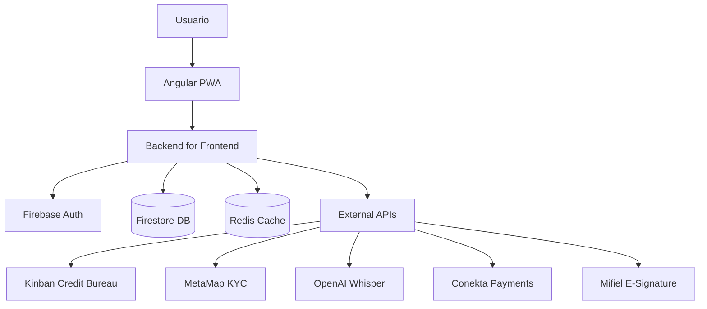
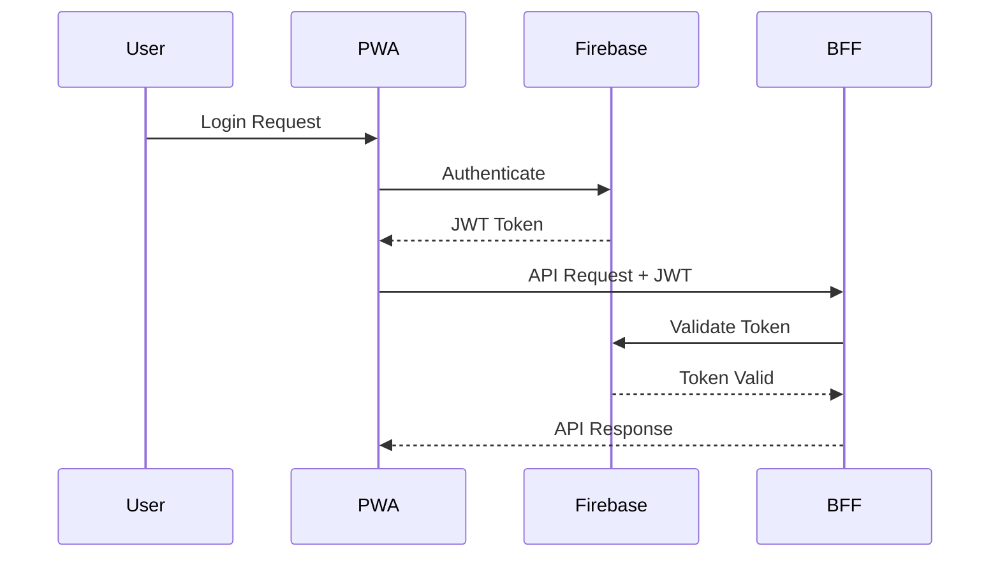

# 📖 Technical Guide – Conductores PWA

## 📑 Tabla de Contenidos

1. [Introducción](#introducción)
2. [Arquitectura General](#arquitectura-general)
3. [Frontend (Angular PWA)](#frontend-angular-pwa)
4. [Backend for Frontend (BFF)](#backend-for-frontend-bff)
5. [Business Logic Engines](#business-logic-engines)
6. [Integraciones Externas](#integraciones-externas)
7. [Autenticación & Seguridad](#autenticación--seguridad)
8. [Configuración & Despliegue](#configuración--despliegue)
9. [Monitoreo & Observabilidad](#monitoreo--observabilidad)
10. [Troubleshooting](#troubleshooting)
11. [Apéndices](#apéndices)

---

## 1. Introducción

Este documento consolida toda la **documentación técnica** de la PWA Angular Conductores, sirviendo como fuente única de verdad para arquitectura, engines de negocio, integración de servicios, seguridad, despliegue y procedimientos operacionales.

### Propósito del Sistema
Conductores PWA es una **Progressive Web Application** enterprise-grade para la gestión integral de conductores y automatización del sistema post-ventas automotriz, implementando engines financieros propietarios y flujos de validación avanzados.

### Alcance Técnico
- **Frontend**: Angular 17+ con Standalone Components y Signals
- **Scale**: 87,957+ líneas de TypeScript
- **Architecture**: Microservicios con BFF pattern
- **Domain**: Fintech automotriz con compliance regulatorio

---

## 2. Arquitectura General

### 2.1 Visión de Alto Nivel



### 2.2 Componentes Principales

| Componente | Tecnología | Responsabilidad |
|------------|------------|-----------------|
| **PWA Frontend** | Angular 17+ | UI/UX, State Management, Client Logic |
| **BFF Layer** | Node.js/Express | API Gateway, Business Orchestration |
| **Authentication** | Firebase Auth | JWT, Session Management |
| **Database** | Firestore | Primary Data Storage |
| **Cache Layer** | Redis | Performance Optimization |
| **CDN** | CloudFlare/AWS | Static Asset Delivery |
| **External APIs** | Multiple | Third-party Integrations |

### 2.3 Flujo de Datos

1. **User Request** → Angular PWA
2. **Client Processing** → Local validation & state update
3. **API Call** → BFF Layer (with JWT token)
4. **Business Logic** → Engine processing & validation
5. **Data Persistence** → Firestore + Redis cache
6. **External Integration** → Third-party APIs (if needed)
7. **Response** → JSON response to client
8. **State Update** → Angular state management

---

## 3. Frontend (Angular PWA)

### 3.1 Estructura del Proyecto

```
src/
├── app/
│   ├── components/          # UI Components
│   │   ├── pages/          # Page-level components
│   │   ├── shared/         # Reusable components
│   │   └── ui/             # UI primitives
│   ├── services/           # Business services
│   ├── models/             # TypeScript interfaces
│   ├── guards/             # Route guards
│   ├── interceptors/       # HTTP interceptors
│   └── utils/              # Utility functions
├── assets/                 # Static assets
├── environments/           # Environment config
└── styles/                 # Global styles
```

### 3.2 State Management

**Strategy**: Service-based state management with BehaviorSubjects
- **Global State**: `StateManagementService`
- **Authentication**: `AuthService`
- **Configuration**: `ConfigurationService`
- **Business Context**: Domain-specific services

**Pattern Example**:
```typescript
@Injectable({ providedIn: 'root' })
export class StateManagementService {
  private readonly _state$ = new BehaviorSubject(initialState);
  readonly state$ = this._state$.asObservable();

  updateState(patch: Partial<AppState>): void {
    this._state$.next({ ...this._state$.value, ...patch });
  }
}
```

### 3.3 Standalone Components (Angular 17+)

**Architecture**: Standalone components for better tree-shaking and modularity

```typescript
@Component({
  selector: 'app-dashboard',
  standalone: true,
  imports: [CommonModule, ReactiveFormsModule, ...],
  template: `...`,
  styles: [`...`]
})
export class DashboardComponent {
  // Component logic with Signals
  readonly data = signal<DashboardData>({});
  readonly loading = signal<boolean>(false);
}
```

### 3.4 PWA Features

- **Service Worker**: Automatic caching and offline support
- **App Manifest**: PWA installation capabilities
- **Push Notifications**: Real-time updates
- **Offline First**: Critical functionality available offline
- **Performance**: Lazy loading and code splitting

---

## 4. Backend for Frontend (BFF)

### 4.1 Arquitectura BFF

**Purpose**: Orchestrate multiple backend services and provide optimized APIs for the frontend

**Key Responsibilities**:
- API Gateway pattern implementation
- Request/Response transformation
- Authentication & authorization
- Business logic orchestration
- Error handling and retry logic
- Logging and monitoring

### 4.2 Service Integration Patterns

```typescript
// Example: Orchestration Service
export class OrchestrationService {
  async processQuotation(request: QuotationRequest): Promise<QuotationResponse> {
    // 1. Validate input
    await this.validate(request);

    // 2. Fetch configuration
    const config = await this.configService.getMarketConfig(request.market);

    // 3. Execute business logic
    const calculation = await this.engineService.calculate(request, config);

    // 4. Store results
    await this.persistenceService.save(calculation);

    // 5. Return response
    return this.transformResponse(calculation);
  }
}
```

### 4.3 Feature Flags

**Implementation**: Configuration-driven feature toggling
- **A/B Testing**: Controlled rollout of new features
- **Circuit Breakers**: Automatic failover mechanisms
- **Configuration Management**: Runtime feature control

---

## 5. Business Logic Engines

### 5.1 Cotizador Engine

**Purpose**: Multi-market vehicle financing with credit evaluation

**Core Algorithms**:
- **PMT Calculation**: Monthly payment computation
- **TIR (IRR) Calculation**: Newton-Raphson method for Internal Rate of Return
- **Amortization Schedule**: Payment breakdown over time
- **Risk Assessment**: Credit scoring integration

**Market-Specific Rules**:
```typescript
interface MarketConfig {
  minDownPayment: number;
  maxDownPayment: number;
  interestRateRange: [number, number];
  termOptions: number[];
  eligibilityCriteria: EligibilityRule[];
}

// Aguascalientes vs Estado de México
const AGS_CONFIG: MarketConfig = {
  minDownPayment: 0.20,  // 20%
  maxDownPayment: 0.50,  // 50%
  interestRateRange: [0.12, 0.18],
  termOptions: [12, 24, 36, 48],
  // ...
};
```

### 5.2 AVI (Advanced Voice Intelligence)

**Architecture**: Dual-engine approach for voice fraud detection

**Scientific Engine**:
- **ML Model**: OpenAI Whisper integration
- **Voice Analysis**: Spectral analysis, pitch detection
- **Fraud Detection**: Synthetic voice detection
- **Quality Metrics**: Audio quality assessment

**Heuristic Engine**:
- **Rule-based Logic**: Business rule evaluation
- **Pattern Recognition**: Historical pattern analysis
- **Threshold Management**: Dynamic threshold adjustment
- **Fallback Strategy**: When ML model unavailable

**Decision Tree**:
```
Voice Input → Preprocessing → Dual Analysis → Decision
                                ↓
                    [APPROVED] [MANUAL_REVIEW] [REJECTED]
```

### 5.3 Protection Engine

**Purpose**: Insurance and protection validation with actuarial calculations

**Core Components**:
- **Coverage Calculator**: Protection amount calculation
- **Premium Estimation**: Risk-based premium calculation
- **Policy Validation**: Compliance with regulatory requirements
- **Claims Processing**: Automated claims validation

### 5.4 Simulador Engine

**Purpose**: Financial projection and scenario modeling

**Features**:
- **Savings Projection**: Future value calculations
- **Scenario Analysis**: What-if modeling
- **Collective Credit**: Group financing simulations
- **ROI Analysis**: Return on investment calculations

---

## 6. Integraciones Externas

### 6.1 Firebase Integration

**Services Used**:
- **Authentication**: JWT token management
- **Firestore**: Primary database
- **Cloud Storage**: Document and media storage
- **Cloud Functions**: Serverless business logic
- **Hosting**: Static asset hosting

### 6.2 Financial Services

**Kinban (Credit Bureau)**:
```typescript
interface KinbanResponse {
  creditScore: number;
  riskLevel: 'LOW' | 'MEDIUM' | 'HIGH';
  creditHistory: CreditHistoryItem[];
  recommendations: string[];
}
```

**Conekta (Payments)**:
- Payment processing
- Webhook handling
- Subscription management
- Fraud prevention

### 6.3 Identity Verification

**MetaMap KYC**:
- Document verification
- Biometric validation
- Identity matching
- Compliance reporting

### 6.4 Document Services

**Mifiel (E-Signature)**:
- Digital signature workflow
- Document integrity
- Legal compliance
- Audit trail

### 6.5 AI/ML Services

**OpenAI Whisper**:
- Speech-to-text conversion
- Voice quality analysis
- Multilingual support
- Real-time processing

---

## 7. Autenticación & Seguridad

### 7.1 Authentication Flow



### 7.2 Security Layers

**Multi-layer Security Approach**:

1. **Transport Security**:
   - HTTPS/TLS 1.3 encryption
   - Certificate pinning
   - HSTS headers

2. **Authentication**:
   - JWT token-based authentication
   - Refresh token rotation
   - Multi-factor authentication support

3. **Authorization**:
   - Role-based access control (RBAC)
   - Resource-level permissions
   - API endpoint protection

4. **Data Security**:
   - Encryption at rest
   - PII data protection
   - GDPR compliance measures

### 7.3 HTTP Interceptors

```typescript
@Injectable()
export class AuthInterceptor implements HttpInterceptor {
  intercept(req: HttpRequest<any>, next: HttpHandler): Observable<HttpEvent<any>> {
    const token = this.authService.getToken();

    if (token) {
      req = req.clone({
        setHeaders: {
          Authorization: `Bearer ${token}`
        }
      });
    }

    return next.handle(req).pipe(
      catchError(error => {
        if (error.status === 401) {
          this.authService.logout();
        }
        return throwError(error);
      })
    );
  }
}
```

### 7.4 Rate Limiting & Retry Logic

**Implementation**:
- Request rate limiting per user
- Exponential backoff retry strategy
- Circuit breaker pattern
- Request deduplication

---

## 8. Configuración & Despliegue

### 8.1 Environment Configuration

**Structure**:
```typescript
export const environment = {
  production: boolean;
  apiUrl: string;
  firebase: FirebaseConfig;
  features: FeatureFlags;
  integrations: {
    kinban: IntegrationConfig;
    metamap: IntegrationConfig;
    openai: IntegrationConfig;
    // ...
  };
};
```

### 8.2 Build Pipeline

**Stages**:
1. **Environment Validation**: Verify all required variables
2. **Dependency Installation**: `npm ci --legacy-peer-deps`
3. **Linting & Type Check**: ESLint + TypeScript validation
4. **Unit Tests**: Jest test execution
5. **Integration Tests**: API integration validation
6. **Security Audit**: `npm audit` + dependency scanning
7. **Build Optimization**: `ng build --configuration production`
8. **Bundle Analysis**: Size validation and optimization
9. **Asset Upload**: CDN deployment
10. **Deployment**: Zero-downtime deployment strategy

### 8.3 Deployment Strategy

**Zero-Downtime Deployment**:
1. **Blue-Green Deployment**: Parallel environment setup
2. **Database Migration**: Schema updates with rollback capability
3. **Health Checks**: Automated health validation
4. **Traffic Switching**: Gradual traffic migration
5. **Monitoring**: Real-time deployment monitoring
6. **Rollback Capability**: Instant rollback on issues

### 8.4 Infrastructure as Code

**Technologies**:
- **Container Orchestration**: Docker + Kubernetes
- **Infrastructure**: Terraform for resource provisioning
- **Configuration Management**: Environment-specific configs
- **Secrets Management**: HashiCorp Vault integration

---

## 9. Monitoreo & Observabilidad

### 9.1 Logging Strategy

**Structured Logging**:
```typescript
interface LogEntry {
  timestamp: string;
  level: 'INFO' | 'WARN' | 'ERROR';
  service: string;
  operation: string;
  userId?: string;
  metadata: Record<string, any>;
  error?: ErrorDetails;
}
```

### 9.2 Metrics Collection

**Key Metrics**:
- **Performance**: Response times, throughput
- **Business**: Conversion rates, user engagement
- **Technical**: Error rates, resource utilization
- **Security**: Failed authentication attempts, suspicious activity

### 9.3 Health Checks

**Endpoint Monitoring**:
```typescript
@Controller('health')
export class HealthController {
  @Get()
  async checkHealth(): Promise<HealthStatus> {
    return {
      status: 'healthy',
      timestamp: new Date().toISOString(),
      services: {
        database: await this.checkDatabase(),
        cache: await this.checkCache(),
        externalApis: await this.checkExternalApis()
      }
    };
  }
}
```

### 9.4 Alerting & Monitoring

**Alert Categories**:
- **Critical**: System down, data corruption
- **High**: Performance degradation, high error rates
- **Medium**: Resource utilization warnings
- **Low**: Informational alerts

---

## 10. Troubleshooting

### 10.1 Severidad 1 – Sistema Caído

**Síntomas**:
- Aplicación no carga
- Errores 500 en todas las requests
- Base de datos inaccesible

**Procedimiento de Diagnóstico**:
1. **Verificar CDN Status**: CloudFlare/AWS CloudFront
2. **Validar Load Balancer**: Health checks y routing
3. **Revisar Database Connection**: Firestore connectivity
4. **Verificar Redis Cache**: Cache layer availability
5. **Reiniciar BFF Services**: Service restart procedure

**Comandos de Diagnóstico**:
```bash
# Check service status
kubectl get pods -n conductores-pwa

# Check database connectivity
firebase firestore:databases:list

# Check cache connectivity
redis-cli ping

# View recent logs
kubectl logs -f deployment/conductores-bff --tail=100
```

### 10.2 Severidad 2 – Funcionalidad Crítica

**Síntomas**:
- Login failures
- Financial calculations incorrect
- Voice validation not working

**Procedimientos**:
1. **AuthService Issues**:
   ```bash
   # Check Firebase Auth status
   firebase auth:export users.json

   # Verify JWT token validation
   curl -H "Authorization: Bearer $TOKEN" /api/validate
   ```

2. **Financial Engine Problems**:
   ```bash
   # Test calculation endpoints
   npm run test:integration:financial

   # Verify market configuration
   curl /api/config/markets
   ```

3. **AVI Voice Issues**:
   ```bash
   # Check OpenAI Whisper API
   curl -X POST https://api.openai.com/v1/audio/transcriptions

   # Test voice processing pipeline
   npm run test:avi:pipeline
   ```

### 10.3 Casos Recurrentes

**Error**: "AVI Voice Intelligence no responde"
```bash
# Solution Steps:
1. Verify OpenAI API key validity
2. Check request rate limits
3. Validate audio format compatibility
4. Test fallback heuristic engine
```

**Error**: "Financial calculations showing incorrect results"
```bash
# Solution Steps:
1. Verify market configuration data
2. Check Newton-Raphson TIR convergence
3. Validate PMT calculation parameters
4. Review business rule updates
```

**Error**: "User session expires prematurely"
```bash
# Solution Steps:
1. Check JWT token expiration settings
2. Verify refresh token rotation
3. Validate Firebase Auth configuration
4. Review session timeout policies
```

---

## 11. Apéndices

### 11.1 Decisiones Arquitectónicas Clave

**ADR-001: Angular Standalone Components**
- **Decision**: Migrate to standalone components
- **Rationale**: Better tree-shaking, improved modularity
- **Impact**: Reduced bundle size, enhanced performance

**ADR-002: Newton-Raphson for TIR Calculation**
- **Decision**: Implement Newton-Raphson method for IRR
- **Rationale**: Superior accuracy vs linear approximation
- **Impact**: Precise financial calculations, regulatory compliance

**ADR-003: Dual-Engine AVI Architecture**
- **Decision**: Scientific + Heuristic voice analysis
- **Rationale**: ML accuracy with rule-based fallback
- **Impact**: 95%+ fraud detection accuracy with reliability

### 11.2 Matriz de Dependencias Técnicas

| Service | Dependencies | Critical Level | Fallback Strategy |
|---------|-------------|----------------|-------------------|
| AuthService | Firebase Auth | 🔴 CRITICAL | Local token cache |
| HttpClientService | Network Layer | 🔴 CRITICAL | Retry with exponential backoff |
| ConfigurationService | Firestore DB | 🔴 CRITICAL | Local configuration cache |
| BusinessRulesService | Configuration | 🔴 CRITICAL | Default rule set |
| CreditScoringService | Kinban API | 🟡 HIGH | Manual review workflow |
| AVI Service | OpenAI Whisper | 🟡 HIGH | Heuristic engine fallback |

### 11.3 Checklist de Transición (Handover)

**Technical Handover Items**:
- [ ] **Access Credentials**: Firebase console, AWS/GCP access
- [ ] **API Keys**: All external service credentials
- [ ] **Database Access**: Firestore admin privileges
- [ ] **Deployment Keys**: CI/CD pipeline access
- [ ] **Monitoring Access**: Logging and alerting systems
- [ ] **Documentation Review**: All technical documentation
- [ ] **Code Repository**: GitHub access and permissions
- [ ] **Environment Configs**: Production environment variables
- [ ] **Backup Procedures**: Database backup and recovery
- [ ] **Security Protocols**: Security incident response plans

**Knowledge Transfer Sessions**:
- [ ] **Architecture Overview**: System design and patterns
- [ ] **Business Logic**: Financial engines deep dive
- [ ] **Integration Patterns**: External service integrations
- [ ] **Deployment Process**: CI/CD and infrastructure
- [ ] **Troubleshooting**: Common issues and solutions
- [ ] **Performance Optimization**: Best practices and monitoring
- [ ] **Security Practices**: Authentication and authorization
- [ ] **Testing Strategy**: Quality assurance approach

### 11.4 Performance Optimization Guide

**Frontend Optimization**:
- Lazy loading for route-based code splitting
- OnPush change detection strategy
- Service worker caching strategies
- Image optimization and lazy loading
- Bundle analysis and tree-shaking

**Backend Optimization**:
- Database query optimization
- Redis caching strategies
- API response compression
- Connection pooling
- Async operation patterns

**Infrastructure Optimization**:
- CDN configuration for static assets
- Load balancer configuration
- Database indexing strategies
- Auto-scaling policies
- Resource allocation optimization

---

**📎 Este documento consolida y reemplaza:**
- `ENTERPRISE_DOCUMENTATION.md`
- `TECHNICAL_APPENDIX.md`
- `DEPLOYMENT_INTEGRATION_GUIDE.md`
- `HANDOVER_CHECKLIST.md`
- `TROUBLESHOOTING_RUNBOOK.md`

**Es la única fuente de verdad para documentación técnica en Conductores PWA.**